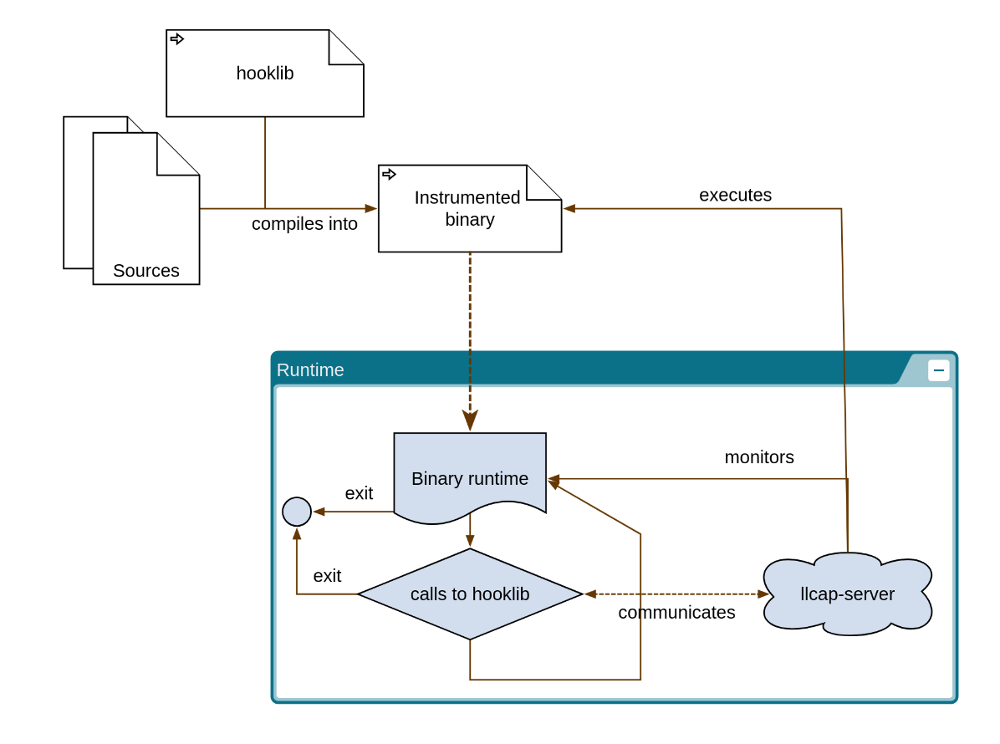
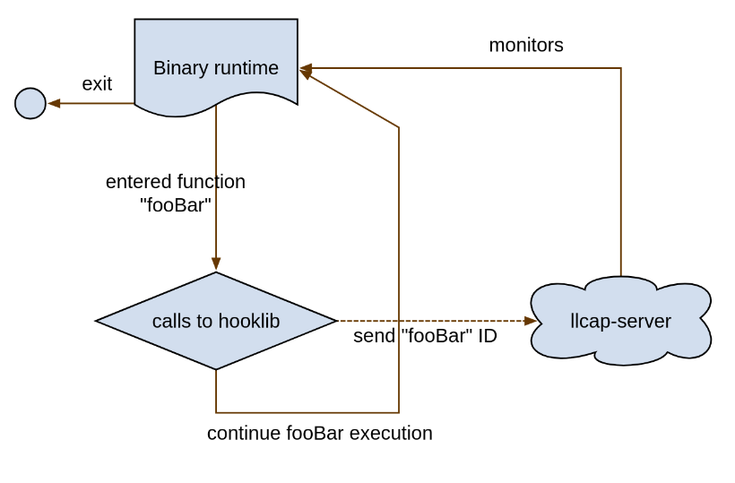
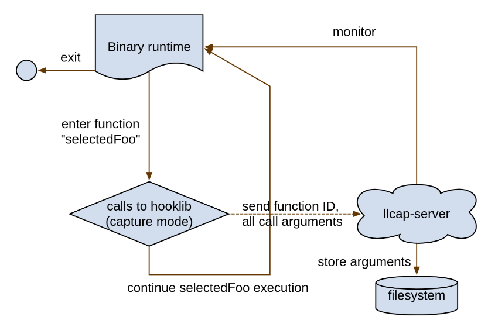
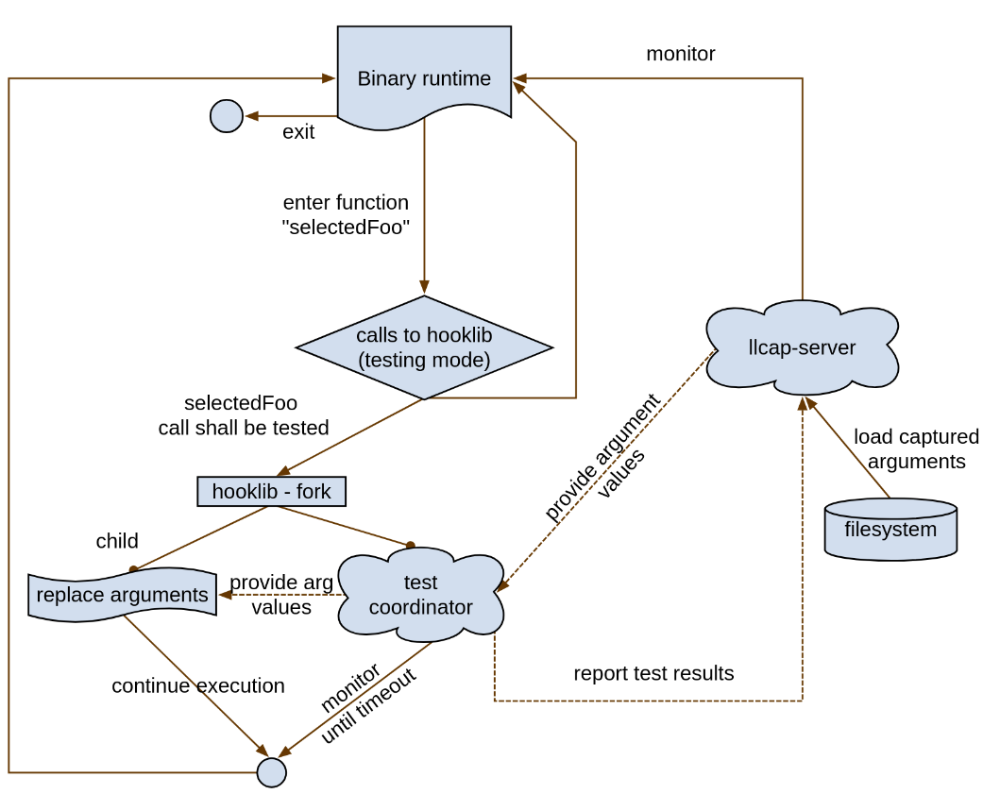

# Research Project: Locating Bugs in C/C++ Programs by Generating Directed Unit Tests 

> [!note]
> This repo requires a (**large**) LLVM submodule. To perform a shallow clone, run:

    git submodule update --depth=1 ./sandbox/llvm-project

## Motivation, context

Suppose we develop a program that contains a bug which causes a crash. In this project, we
try to create tools to help investigate root causes of such bugs by automatically testing the
target program. The tools and plugins developed as a part of this project aim to assist in automating the following:

* capture of calls to non-builtin/library/external functions
* capture of argument values of user-specified functions
* hijacking of the arguments of the user-specified functions
* monitoring of the hijacked program (where the possibly bug-triggering argument sets will stand out)

## Limitations

In its current form, the tool cannot instrument or test:

* multi-threaded code
* variadic functions

## Demo

We provide a complete demo in the form of a small C++ program inside the [example-arg-replacement](./sandbox/02-ipc/example-arg-replacement) directory.

## Containers

Demo container is available on [Docker Hub](https://https://hub.docker.com/r/vasutro/llcap-demo-env) (est. 650MB download):

        podman run -it docker.io/vasutro/llcap-demo-env:1.2.0

Last commit of this repository used to build the container and test the demo: 

`7f04071b5c82a8052bc327e59994c9a81ce69958`

For usage, refer to the [example-arg-replacement](./sandbox/02-ipc/example-arg-replacement) directory.

For container internals & development container information, see [podman](./podman/) directory.

## Setup & Build

To **use** the tools, you merely have to use our [patched version of LLVM/clang](./sandbox/01-llvm-ir/clang-ir-mapping-llvm.diff) (you can use our [demo container](#containers)), 
adjust your build tools to use the patched compiler, pass 
[additional](./sandbox/02-ipc/example-arg-replacement/build-arg-trace.sh) [arguments](./sandbox/02-ipc/example-arg-replacement/build-call-trace.sh) to it and [link our "hook" library](./sandbox/02-ipc/e2e-tests/testbin-c-example/CMakeLists.txt).

To **build** the tools:

> [!note] Prerequisites: 
> `git`, `cmake`, C/C++ toolchain, `ninja`, `xargs`
>
> `cargo` and `rustc` (both version >=1.88, more on that in the [relevant part of the repo](./sandbox/02-ipc/llcap-server/))

### Setup LLVM

```sh
git submodule update --init --depth=1 ./sandbox/llvm-project
# apply our clang patch
cd ./sandbox/llvm-project
git apply ../01-llvm-ir/clang-ir-mapping-llvm.diff
cd ../../
```

### Building

```sh
# to build the AST plugin
cd ./sandbox/01-llvm-ir/custom-metadata-pass
./setup-tool.sh
cd ../../
./setup-llvm-build.sh
cd ../build

# this step takes A LONG TIME (and GBs of disk space)
ninja -j $(nproc)
```

To install:

> [!Warning]
> the `ninja install` step may not be totally reversible! We recommend setting up a VM for your testing & development environment

```sh
sudo ninja install
sudo ninja tools/clang/examples/ast-meta-add/install/local
```
To uninstall:

```sh
xargs rm -rf < install_manifest.txt
```

Next, you will also need to build (commands shall be executed in the tools' subdirectories):
* [LLVM pass plugin](./sandbox/01-llvm-ir/llvm-pass) (**depends on** `llvm-project`) - `cmake ./ && make` 
* [hook library](./sandbox/02-ipc/ipc-hooklib/README.md) - `cmake ./ && make` (independent)
* [`llcap-server`](./sandbox/02-ipc/llcap-server/README.md) - `cargo b` or `cargo b --release` (independent)

## Organization

Code style in most sources that `#include` LLVM headers is (auto)enforced by `clangd`/`clang-tidy` (LLVM style).
Other files have no code style enforced (unless a `.clang-tidy` file is present). Most of the time, running `cmake ./ && make` should result in a successful build.
 

1. [`notes`](./notes/) subdirectory generally unorganized notes
    * [`Notes from related papaers`](./notes/00-paper-notes.md)
    * [`Initial analysis`](./notes/00-initial-analysis.md), and [`progress updates`](./notes/00-progress-updates.md) - bulletpoint-style thoughts on, pros/cons of, and issues with various methods
    * [`TODOs`](./notes/000-TODOs.md)
    * [LLVM IR metadata emission notes](./notes/01-llvm-ir-metadata-emission.md)
    * various dead ends or other issues encountered ([LLVM demangling discrepancies](./notes/0x-llvm-demangling.md) and [notes on MLIR](./notes/02-mlir-notes.md))
2. [`sandbox`](./sandbox/) - demo-style exploration of approaches used in our solution
    * [`00-clang-ast`](./sandbox/00-clang-ast/) - *source-level* modification of the Clang's AST
        * modify source code by inspecting and rewriting the AST
        * recompile modified source code with an instrumentation library linked in
    * [`01-llvm-ir`](./sandbox/01-llvm-ir/) - LLVM IR modification
        * compile source into LLVM Intermediate Representation (IR)
        * inspect and modify generated IR by adding instructions (mostly `call`s into instrumentation library functions)
        * compile modified IR with an instrumentation library
    * [`02-ipc`](./sandbox/02-ipc/) - experiments with Inter-process communication (coordination of tests)
        * requirement: extraction of data from the instrumented application
        * The instrumentation library's responsibility is to establish connections back to "us" and send "us" data
        * preparation for the final stage: executing targeted tests (i.e., sending our data into a tested function)

Other folder naming:

* `working` - a "working folder", a place where most of the commands are executed / most files are being changed, gitignored, ...
* `build*` - most output artifacts will end up here

## Concepts

On a high level, the project aims to instrument functions so that their arguments can be modified
just before the given instrumented function executes. We designed and implemented a non-trivial
infrastructure that allows this workflow, and throughout the accompanying text, we will try to use unified terminology to refer to the individual parts of the infrastructure.

First, we describe the high-level concepts that are core to the architecture. 

### Instrumented program

We will mostly refer to an **instrumented program**.
The instrumented program is the program under the test. The instrumentation which creates this program is required to have **minimal** effect on the execution flow of the program. That is, during the instrumented program runtime, we want to *ideally* achieve the same branches taken, functions called with the same arguments, etc. as in the uninstrumented case's runtime (given a deterministic program). In other words, we want the instrumentation to be unintrusive.

### `hooklib` or the hooking library

The `hooklib` is a library designed to be used by the *instrumented program* to perform tasks
that are specific to our testing approach. Primarily, *instrumented program* calls into `hooklib`
to communicate with all the surrounding infrastructure, we implement in this project.

### `llcap-server`

The `llcap-server` ("LL capture" server) is the largest piece of the architectural puzzle we present.
The `llcap-server` is designed to be the central point: it launches and monitors the instrumented binary, it sets up the environment required by the instrumented program and `hooklib`, and cooperates with them, achieving the goals of the project by interacting with the user.



### Phases

The workflow we will present consists of 3 phases. Each phase requires slightly different instrumentation. Two instrumentation passes on the tested program are required (1 for the first phase, the other for the rest). Here, we list the phases and describe their purpose. We also **emphasize** important concepts:

1. **Call tracing** - collects information about what functions have been entered in the instrumented program
    * user selects the **target functions**, which are subject to further tracing and final testing
    * the selection is then used to perform instrumentation of the *target functions* 

Runtime diagram:



2. **Argument capture** - collects raw copies of arguments of the *target functions* and stores them for the subsequent phases
    * we call the set of all arguments of the `n`-th call to function `foo` the **foo's n-th argument packet**

Runtime diagram (the binary running is the binary created by instrumenting *target functions*):



3. **Testing** - performs an exhaustive replacement of arguments of a target function with all its *argument packets* recorded in the previous (*argument capture*) phase
    * our implementation performs a `fork`-based testing - the *instrumented binary* is launched in testing mode and monitored by the `llcap-server`. We call this instance of the instrumented program the **test coordinator** and its functionality is implemented inside `hooklib`
    * *test coordinator* decides when a test is launched (when a `fork` is performed and arguments are substituted with an *argument packet* obtained from the `llcap-server`). It also monitors the test and reports results back to the `llcap-server`

Runtime diagram:



## Tests

* to run `llcap-server` tests, `cd ./sandbox/02-ipc/sandbox && cargo t && cargo t --release`
* to run end-to-end tests, `cd ./sandbox/02-ipc/e2e-tests/test && run-all-tests.sh`
* to run `llvm` and `clang` tests (only `clang` tests should be relevant), `cd build && ninja check-clang` (or `check-llvm`)
    * you might need to install `perl-Hash-Util` and `perl-FindBin`

### Note on `clang` tests

You will see 21 failures.

* these are caused by our `clang` patch - it reorders the IR metadata because it adds 2 extra **module**-level entries
* due to our patch, the metadata values may be shifted by exactly 2 (`!4` instead of `!2`)
    * otherwise, the relative positions and references are the same

We deem this to be the limitation of the testing framework. It either cannot or the test authors did not "dynamically" match the metadata.

The current results of `check-clang` with checkmars:

* `SHIFT` for correct output, but shifted metadata causing the failure (brief description provided)
* `UNSUP` for unsupported architecture/target (also affected by the metadata position shift)

Please note that even `UNSUP` failures were inspected. Just not as thoroughly as `SHIFT` failures

```
Total Discovered Tests: 46875
 Skipped          :     6 (0.01%)
 Unsupported      :  4034 (8.61%)
 Passed           : 42785 (91.27%)
 Expectedly Failed:    29 (0.06%)
 Failed           :    21 (0.04%)

SHIFT Clang :: CodeGen/asm-goto2.c
 - 6 mismatches, shifted by 2
SHIFT Clang :: CodeGen/catch-implicit-integer-sign-changes-incdec.c
 - 8 mismatches shifted by 2 
SHIFT Clang :: CodeGen/memcpy-inline-builtin.c
 - 2 mismatches shifted by 2
SHIFT Clang :: CodeGen/sanitize-metadata-ignorelist.c
 - shifted by 2
SHIFT Clang :: CodeGen/ubsan-function-sugared.cpp
 - shifted by 2, arm-none-eabi, IR has to be generated
SHIFT Clang :: CodeGen/ubsan-function.cpp
 - shifted by 2, arm-none-eabi, IR has to be generated
 - this one and the one above are ARM-specific; they mismatch on 3 ARM rules, which are the only ones with hardcoded metadata keys
SHIFT Clang :: CodeGenCXX/attr-likelihood-switch-branch-weights.cpp
 - shifted by 2, multiple mismatches
 - IR has to be generated
SHIFT Clang :: CodeGenCXX/debug-info-ms-novtable.cpp
 - shifted by 2, expects hardcoded metadata `scope: !10`
 - IR has to be generated from the command (provided by the log)
SHIFT Clang :: utils/update_cc_test_checks/annotations.test
 - shift by 2
SHIFT Clang :: utils/update_cc_test_checks/check-globals.test
 - expects exact match of `//.` at the end of the file
SHIFT Clang :: utils/update_cc_test_checks/generated-funcs.test
 - shift by 2

UNSUP Clang :: CodeGen/AArch64/ls64.c
UNSUP Clang :: CodeGen/LoongArch/inline-asm-operand-modifiers.c
UNSUP Clang :: CodeGen/LoongArch/lasx/inline-asm-gcc-regs.c
UNSUP Clang :: CodeGen/LoongArch/lasx/inline-asm-operand-modifier.c
UNSUP Clang :: CodeGen/LoongArch/lsx/inline-asm-gcc-regs.c
UNSUP Clang :: CodeGen/LoongArch/lsx/inline-asm-operand-modifier.c
UNSUP Clang :: CodeGenObjC/arc.m
UNSUP Clang :: CodeGenObjC/matrix-type-operators.m
UNSUP Clang :: OpenMP/parallel_for_simd_codegen.cpp
UNSUP Clang :: OpenMP/target_in_reduction_codegen.cpp
```

We resolved ~525 test failures by avoiding adding **function** metadata and doing so only when "necessary" (based on the presence of AST pass's metadata). While this makes the tests pass, it also reduces the test coverage because parts of the patch never run during testing. We offer the
following points to try to convince the reader that our patch does not introduce miscompilation:

1. we are not aware that our metadata usage may call LLVM intrinsics or interact with the executable beyond the scope of our goals and tools
2. quick inspection of the test logs showed that nearly all mismatch failures were most likely due to the presence of the extra metadata key we attach to functions
3. only "tested" applications are potentially affected - unless you use the AST pass, the compilation is equivalent (apart from the above explained failures caused by **module**-level changes)

So far, we haven't yet figured out how to insert our **module** metadata as the very last entries,
which would make the above 21 tests pass.

# AI/LLM usage disclosure

LLMs have been used to consult on **exactly and only** these topics  (used models: ChatGPT 4, Gemini 2.5 Flash):

## AI/LLM content that was NOT used

1. Brief overview of the capacities of LLVM to transfer information between individual LLVM passes
    * dead end
2. Quick preliminary analysis of a [demangling issue encountered](./notes/0x-llvm-demangling.md)
    * majority was a "quick intro" to mangled symbol "syntax"
    * analysis in the [linked document](./notes/0x-llvm-demangling.md) was performed by human
3. Linking of multiple libraries into one
    * generated `Cmake` examples not functional
4. Discussion of ZMQ's buffer flushing - whether it is possible to force-flush them
    * last resort option used after studying documentation & searching internet forums
    * results *not used*

## AI/LLM content used in this project

1. Generation of boilerplate code to set up a LLVM pass
    * < 25 lines of code artifacts used, combined with official documentation
    * usage of `llvmGetPassPluginInfo`, `registerPipelineStartEPCallback` in [the LLVM pass](./sandbox/01-llvm-ir/llvm-pass/src/pass.cpp)
2. Translation of CMake directives (in `CMakeLists.txt`) specifying compile time options for LLVM plugins (`-mllvm`) into `cmake` options supplied on the command line
    * plus a discussion of possibilities regarding individual-file setting of such flags (instead of project-wide scope) - *not used*
3. Parsing numbers in C++ without exceptions (e.g. without `std::stoi`, ...)
    * only used as a reference point, usage of `std::from_chars` in this codebase is derived from official documentation
4. Final report generation and initial proofreading
    * generated and heavily edited several `Components` paragraphs
    * generated and slightly edited the first `Conclusion` paragraph
    * proofreading of the entire document, cherry-picking phrasing and flow
