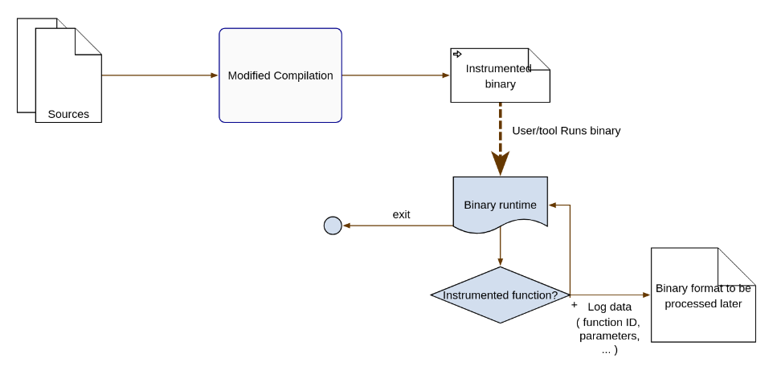

# Initial analysis

This document contains initial analysis of the problem. Further progress is documented in the [updates document](./00-progress-updates.md). 

**Rough outline:**

* [C++ instrumentation ecosystem](#c-instrumentation-ecosystem)
* [(initial) Thoughts on Architecture](#thoughts-on-architecture)

# C++ instrumentation ecosystem

## Demands on the (instrumented) application

* should not modify itself 
* should not use advanced security features (shadow stacks, stack cookies)

## Static instrumentation

**Additional demands**: dynamically-loaded libraries disallowed

### Ideas:

1. Syntax tree manipulation
    * add recording framework (bunch of source files external to the compiled source)
    * inject recording skeleton (into the syntax tree of compiled source)
    * attempt to compile
    * [should be rare: resolve conflicts (clashes in variable names) & recompile]

2. LLVM IR manipulation

### Notes - syntax tree manipulation

GCC seems extremely complicated. Clang AST might be a good candidate, although it is also complex.
Will try on smaller example. 

#### CLANG AST : [talk - 2013 - about the AST](https://www.youtube.com/watch?v=VqCkCDFLSsc)

* syntactical objects have IDs -> used in ASTContext
* `makeFileCharRange`, `measureTokenLength`
* AST of template *definition* and *instantiation* available (but AST nodes can be shared!!!)
* interface: `RecursiveASTVisitor` - selective, no context - has to be retreived "online"
* clang `ast-dump` `ast-dump-filter` `ast-list`
* `clang -Xclang -ast-dump srcfile`


Progress: **sandbox-00-clang-ast** demonstrates how to inject code to a source-available project.

<details>
<summary>
Expand **Before**
</summary>

```c++
#include <iostream>

namespace __framework {

    class Reporter {
        public:
        template<class T>
        static void report(T val, const char* info) {
            std::cout << "recorded value: " << val << " " << info << '\n';
        }
    };
}
    

int int_called_with_int_float(int i, float f) {
    return i * f;
}


float float_called_with_double_int(double d, int i) {
    return d * i;
}

int everything() {
    return int_called_with_int_float(0, 3.2f) + float_called_with_double_int(4.4, 32);
}

int main() {
    return everything();
}
```
</details>


<details>
<summary>
Expand **After**
</summary>

(after minor formatting + addition of `__framework`)
```c++
#include <iostream>

namespace __framework {

    class Reporter {
        public:
        template<class T>
        static void report(T val, const char* info) {
            std::cout << "recorded value: " << val << " " << info << '\n';
        }
    };
}
    

int int_called_with_int_float(int i, float f) {
::__framework::Reporter::report(i, "i");
::__framework::Reporter::report(f, "f");

    return i * f;
}


float float_called_with_double_int(double d, int i) {
::__framework::Reporter::report(d, "d");
::__framework::Reporter::report(i, "i");

    return d * i;
}

int everything() {
    return int_called_with_int_float(0, 3.2f) + float_called_with_double_int(4.4, 32);
}

int main() {
    return everything();
}
```
</details>

TODOs:
* "reporting `__framework`" injection
    * solution: linked library, **major issue**: `#include` of the library header is needed for recompilation to succceed
* optionaly don't perform syntax/compilation checks? (for large projects)
    * no idea what exactly was meant by this...
* clang TOOL vs clang PLUGIN (use tool, recompile vs perfrom changes as a compiler pass)
    * semi-decided: LLVM IR pass seems better as the current AST modification would perform way too many risky operations
        * (syntactic) errors when rewriting the AST, preserving semantics of the language, ...

<details>
<summary>
Possible improvement via *Replacements* (**not used**)
</summary>

(see [link](https://github.com/jkelling/HIP/blob/100c8c83c1f54e4f78d50c64307b9e7083498da2/clang-hipify/src/Cuda2Hip.cpp#L906C1-L917C1))

```c++
  for (const auto &r : Tool.getReplacements()) {
    DEBUG(dbgs() << r.toString() << "\n");
  }

  Rewriter Rewrite(Sources, DefaultLangOptions);

  if (!Tool.applyAllReplacements(Rewrite)) {
    DEBUG(dbgs() << "Skipped some replacements.\n");
  }

  Result = Rewrite.overwriteChangedFiles();
```
</details>

**Setup**

    cd sandbox/00-clang-ast
    git clone https://github.com/llvm/llvm-project
    ./setup-llvm-build.sh
    ./setup-tool.sh
    ./build.sh

Important question of [**capturing program state**](#capturing-program-state) using the instrumentation.

## Dynamic instrumentation

### Pin

(quotes from Pin docs)

#### Limitations/requirements:

* x86-only
* debug symbols

<details>
<summary>
Pin issue that might be useful to know about later
</summary>
> There is a known limitation of using Pin on Linux systems that prevent the use of ptrace attach via the sysctl /proc/sys/kernel/yama/ptrace_scope. Pin will still work when launching applications with the pin command line. However, Pin will fail in attach mode (that is, using the -pid knob). To resolve this, do the following (as root):

    $ echo 0 > /proc/sys/kernel/yama/ptrace_scope
</details>


Major issue:

> Tools must refrain from using any native system calls, and use PinCRT APIs for any needed functionality.

> A C++ runtime. Please note that the current version **does not support C++11 and RTTI** (Run-Time Type Information).

#### Pin Instrumentation Granularity:

1. Trace - branchless instruction sequences (branching into a sequence means a new sequence is created)
2. Instruction
3. Image / Routine - image consisting of sections consisting of routines consisting of insns

Instruction & Trace - JIT
Image & Routine - AoT

>  the `IMG_AddInstrumentFunction` API call. Image instrumentation **depends on symbol information** to determine routine boundaries hence `PIN_InitSymbols` must be called before `PIN_Init`.

#### Tail calls

> Routine instrumentation utilizes the `RTN_AddInstrumentFunction` API call. Instrumentation of routine exits **does not work reliably** **in the presence of tail calls** or **when return instructions cannot reliably be detected**.

disabling tail calls:
* GCC: `-fno-optimize-sibling-calls`
* clang: `[[clang::disable_tail_calls]]`, `-mno-tail-call`, `-fno-escaping-block-tail-calls`


#### Function argument/return value access

Not supported by Pin directly - only symbol names.

1. Have Debug Symbols as a requirement, parse debug symbols using a library (`libdwarf`) & generate instrumentation based on the function's arguments

2. (C++-only) (**unreliable**) De-mangle function names to determine the function arguments & generate instrumentation based on it

#### Multi-threading

> Pin provides its own locking and thread management API's, which the Pintool should use. (and not regular system tools!) 

> Pintools on Linux also need to take care when calling standard C or C++ library routines from analysis or replacement functions because the C and C++ libraries linked into Pintools are not thread-safe.

> Pin provides call-backs when each thread starts and ends (see `PIN_AddThreadStartFunction` and `PIN_AddThreadFiniFunction`).

(Pin also provides) Pin-specific thread-local storage.

#### Logging

> Pin provides a mechanism to write messages from a Pintool to a logfile. To use this capability, call the LOG() API with your message. The default filename is pintool.log, and it is created in the currently working directory. Use the -logfile switch after the tool name to change the path and file name of the log file.

#### Problems

* collecting a stack trace (can we correclty capture a thread's ID? Can we access the stack trace? Do we even need the stack trace?)

* **capturing program state** for running a test (what is the mechanism?)
    - `-pin_memory-range` to contain Pin in a certain address range - may help woth reproduction
    - JIT mode

> On Linux IA-32 architectures, Pintools are built **non-PIC** (Position Independent Code), which allows the compiler to inline both local and global functions. Tools for Linux Intel(R) **64 architectures are built PIC**, but the compiler will not inline any globally visible function due to function pre-emption. Therefore, it is advisable to declare the subroutines called by the analysis function as 'static' on Linux Intel(R) 64 architectures.

(*irrelevant?*) How do we deal with this (PIE/non-PIE)? (dynamic object tree dump - IMO requires full instrumentation of all memory accesses inside every function call)

# Thoughts on Architecture

## Capturing arguments & return values

* to consider: if dealing with anything other than built-in types (primitives), would it even be possible to reliably (statically) instrument a function for return-value retreival?
    * returning a temporary uses things like copy/move elision, NRVO, ... (compiler-specific tricks for inlined functions, ...)
    * if we cannot reliably capture those kinds of objects, we would need dynamic instrumentation to inspect every single branch (linked call) **after** it happens, registering the returned value
    * this could boil down to just calling the proper ctor before a `return` 

Rough outline of a part of such capture:



## Capturing program state

Objects of interest, their inputs, outputs:

1. Free-stadning functions
* IN: arguments, global/thread-local state (possibly large object graph)
* OUT: retval, global state modification

2. Object methods
* IN: arguments, object graph (`this` and global/thread-local state)
* OUT: retval, object graph modifications (`this` and global/thread-local state)

`=>` both objects of interest need global/thread-local object graph for case reconstruction

`???` locks... program state may hold information on synchronization - process isolation inside a unit test may catastrophically interact with synchronization primitives:


1. N-threaded program (N > 1) running (on N threads)
2. Capture the state of thread X before executing fn `foo`
3. Generate unit tests, ...
4. Execute unit tests of function `foo` on a single thread

If `foo` e.g. waits on a barrier expecting N threads, N > 1. If `foo` does not spawn tasks on other threads that execute this same function, only 1 thread (unit-test thread) appears at the barrier, never finishing.

`???` IO/system resources - unit test (<- ?) should be testing a fairly isolated function

This implies two things: unit-test timeouts are needed, multi-threaded execution is hazardous for this approach and it is extra tricky to ensure OS resources (IO/networking, ...) are handled correctly by external unit test. 

Approaches for program state capture:

1. capture-all - probably simplest to implement but one with the ?most? runtime overhead
    * copy-on-write address space copy & attachment of unit tests into the addres space may help with performance costs (**this essentialy means `fork` or `clone`-ing the process BEFORE the function call is made / before the first statement of the function is (even partially) executed**)
    * full recreation of conditions may be impossible due to resource usage
        * additional approaches - networking/IO hypervisor
        * rule out the usage of "shared memory" or perform a blocking copy/toggle to non-shared in the forked process 
        * `clone` syscall enables greater granulalrity for controlling what gets cloned than `fork`
    * forked process would then call a memory-capturing funciton or get "deactivated"
    * "deactivated" process would wait for messages (IPC) with commands
        * for every command (e.g. function arguments and expected values), the process will be forked further, injecting/rewriting/using supplied arguments to continue function execution
        * furhtermore, in the forked process, the return statements will get replaced by saving a return value and sending it to the parrent process, this sequence terminates the child process (unit test executed, return value would be inspected in the parent)  
    * we have to prohibit recursive `clone` for any type of recursion (direct/indirect)
    * how to integrate (if possible, with a testing framework)
    * unknowns - never used `clone` - thread-locals? limitations coming from the parent process (`MADV_DONTFORK`)
2. capture-only-necessary - probably very lightweight but I think it is too difficult to pull off (library depdnencies, ABI, the inability to introspect C/C++ programs at runtime, statically dumping object representation may require arcane compiler knowledge, dynamic dumping presents the challenge of injection into a unit test - relocation of code, proper page mapping)

Simplified "forking approach" diagram:


### Discussion on `clone` method

#### Questions

* will static instrumentation be enough in this case, to implement all necessary steps?
* will the suggested solution be considered too invasive?
* in case it will be considered too invasive, is it possible to rewrite the entire function with a wrapper?
* 

<details>
<summary>
Idea of a `clone`-wrapper workflow
</summary>

```c++

int target(float arg) {
    // original funciton whose contents have been migrated to target__impl
    return target__test(arg);
}

int target__test(float arg) {

    auto params = receiveParams()

    for (auto&& param : params)
    {
#ifndef JOIN_STRATEGY
        sleep_if_too_many_clones_in_parallel(); //i.e. too many pending (not-received) results
#endif
        auto [child, is_parent] = clone_syscall(SETTINGS);
        if (is_parent) goto XXXX;

        float testArg = args.arg;
        int testRetVal = target__impl(testArg);
        
        auto result = evaluate(testRetVal, param.expected); 
        setResult(result, child);
        exit();
XXXX:
#ifdef JOIN_STRATEGY
        auto child_ran_too_long = child.join_with_timeout();
        if (child_ran_too_long) {
            REPORT_CHILD_RAN_TOO_LONG();
        } else {
            registerResult(fetchChildResult(child));
        }
#else
        childList.store(child);
#endif
    }

    // terminate without affecting optimizations (make sure code ends up here)
    return 0;
}

int target__impl(float arg) {
    // real implementation of "target"
    return 1;
}

```

</details>
 
#### Limitations

* `pin` might not be a viable candidate for this stage as it requires a syscall (`clone`)

## Other tools/references

* [traces](https://github.com/yotamr/traces) - static (`clang` plugin) "type-aware" funciton tracing
    * particularly [Architecture](https://github.com/yotamr/traces/wiki/Architecture)

* [gcc instrumentation](https://www.kernel.org/doc/html/v5.6/core-api/gcc-plugins.html)
    * [usage](https://www.codingwiththomas.com/blog/accessing-gccs-abstract-syntax-tree-with-a-gcc-plugin)
