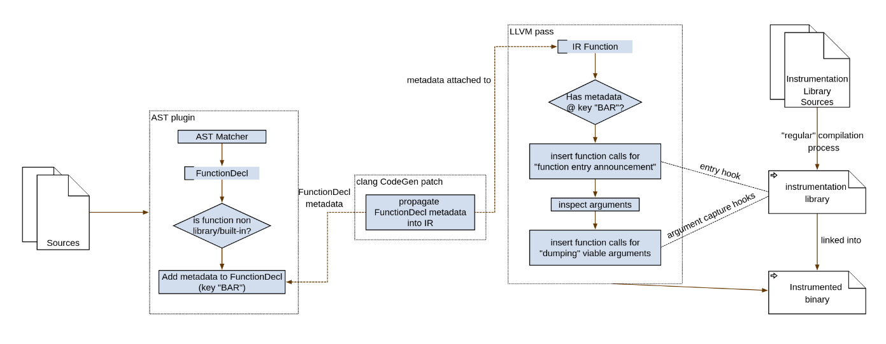
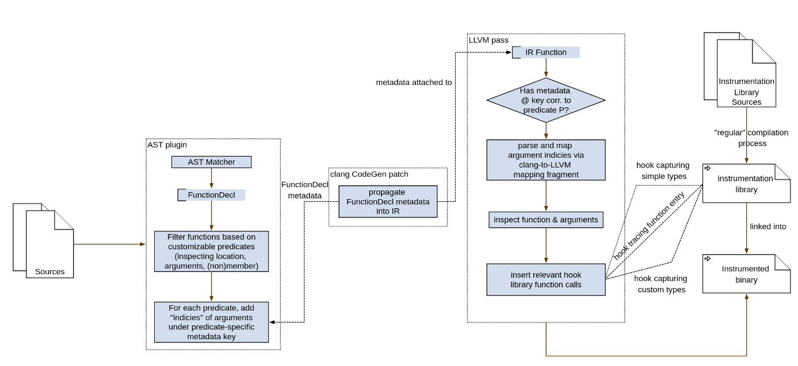
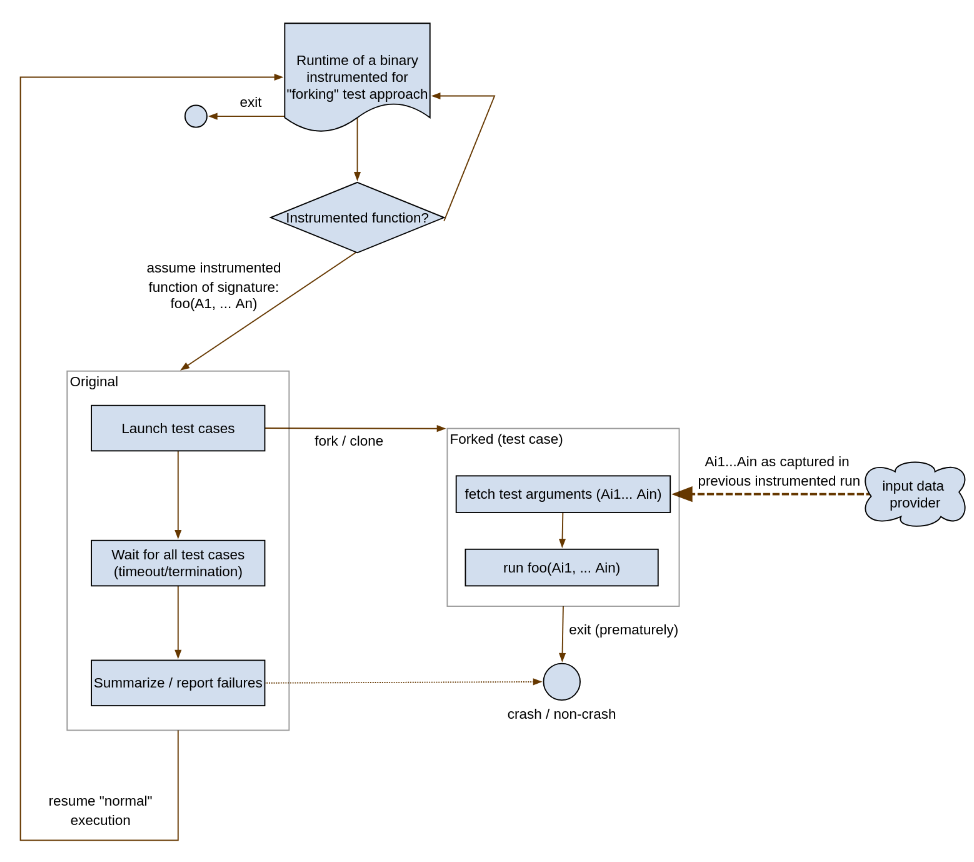

**Progress updates (2025):**

* [end of March 2025](#end-of-march-2025)
* [April 14](#april-14)
* [April 28](#april-28)
* [May 19](#may-19)
* [June](#june)
* [End of June](#end-of-june)

# End of March 2025

## Implementation (issues with): AST rewriting

* initial prototypes looked promising
* when delving into finer implementation details, I discovered that the approach is, however, infeasable due to the following

1. `C` and `C++` discrepancy
    * altering syntax when targeting multiple languages requires syntactic rewriting to consider supoprted languages
    * this requires near-expert knowledge to be certain that modified programs won't be rejected by C and C++ compiler
    * passing arguments to our argument-capturing library, for example, could become a major issue when attempting to support more complex types
        * rule-of-five-type nuances
        * ensuring global uniqueness of possible temporary identifiers, ...
    * Templates are entirely unsupported due to the possibility of instantiations which take unsupported types as arguments (e.g `tempalte<class T> foo(const T& x)` and `foo<int>`, `foo<CustomWeirdClass>`)
        * this would either require specialization or compile-time magic to be injected to the template body, complicating the code modifications & rule adherence even further
    * NOT investigated (maybe TODO?): lambda support
        * how to visit with the AST Matcher
        * how to inspect - CAPTURED varaibles 

2. Clang's AST manipulation is not as flexible as expected
    * AST rewriting does not (to my knowledge) expose an API to "create" valid functions
    * moreover, deep return type inspection of functions omits qualifiers and return type deduction would probably also not yield any information
        * this mainly complicates the `clone` approaches' function duplication

3. Library Calls Require Additional risky step
    * for the modified source to be recompiled again, it must ensure the `#include` of a library header we would use to trace execution
    * this is impossible within the AST API, furthermore, adding `#include`s "wherever" is not safe
        * e.g. precompiled headers, some domain-specific requirements, ...

The current implementation instruments the sample (C++-only) code to "record" function entry/exit or function arguments (although with dodgy or outright dangerous syntax). The current AST instrumentation also leverages C++'s destructors to differentiate between "regular" returns and exceptions (as an exercise/in initial stages, it this has been a simpler way to track the function scope than inspecting and modifying `return` statements and possibly their vicinity - due to e.g. single-non-compound-statement `if (cond) return x;` ).

### Relevant source files:

* [library interface](../sandbox/00-clang-ast/inject-w-library/lib/include/funTrace.hpp)
* [AST rewriter](../sandbox/00-clang-ast/cpy-to-llvm-project/clang-tools-extra/ast-injection-with-lib/AstInjection.cpp)
* [test program - raw](../sandbox/00-clang-ast/instr-rapid-iter/test-program.cpp)
* to perform instrumentation, run either [`ftrace-program-instr.sh`](../sandbox/00-clang-ast/instr-rapid-iter/working/ftrace-program-instr.sh) for function tracing or [`program-instr.sh`](../sandbox/00-clang-ast/instr-rapid-iter/working/program-instr.sh) for parameter tracing

The only positive compared to a custom LLVM IR pass would be the ability to easily differentiate between built-in/library/`#include`d functions from "user" functions.

## Runtime overhead and possible speedup by recording in two passes

It might come in handy to perform a two-phase execution before test-case generation:
1. Run Function Tracing Instrumented code - generates a list of called (and exited) functions
    * **then let user select** a funciton whose input values should be recorded
2. Run Function Argument Recording Instrumented code - no user interaction needed
3. Run Function Unit-Testing code using recorded arguments

This introduces a overhead of recompilation for each different function to be examined. Results could be cached though or the instrumentation could be "conditional" based on a function identifier.

## LLVM IR instrumentation

Approach similar to the AST rewriting: instrument functions & call to a runtime library.

### Relevant source files:

* [custom compiler pass](../sandbox/01-llvm-ir/llvm-pass/pass.cpp)
    * injects IR with various calls to our library
* [skeleton of a support library](../sandbox/01-llvm-ir/test-pass/hooklib/hook.c)
    * provides a simple interface as a proof-of-concept
* [code to instrument in C](../sandbox/01-llvm-ir/test-pass/test-program.c)
* [code to instrument in C++](../sandbox/01-llvm-ir/test-pass/test-program.cpp)
* [how to instrument the sample code and outputs for the instrumented code](../sandbox/01-llvm-ir/test-pass/working/HOWTO.md)
    * instrumented IR 

### Issues:
* library vs non-library functions
    * so far relies on specific mangling (unstable)
    * could be solved by passing aditional metadata from the previous compilation phase into the IR
* cannot distinguish between signed & unsigned integers - overall, support of types limited to LLVM IR types
    * could be solved by the same technique as above (exporting more metadata to the IR) - would introduce language-specific requirements
    * could be possible to write type-specific handlers of LLVM IR function parameters (e.g. a pointer to `std::string`, ...)

### Advantages over AST technique
* no messy `#include`ing - only linker errors
* no C/C++ syntax/type system/move semantics quirks and failure vectors
* no danger of being incompatible with certain language constructs
* generally more language-agnostic

# April 14

* [public repo - mirror](https://git.bohdanqq.com/BohdanQQ/research-project)


## IR Metadata
* initial idea was to traverse AST and add metadata to functions
    * OK since IR metadata can be attached to module/function/instruction
    * inspection on AST level allows analysis of function arguments

* **did not** find a way to attach metadata to `FunctionDecl` (AST-level representation)

Remedies:
* a simple [patch](../sandbox/01-llvm-ir/custom-metadata-pass/custom-metadata.diff) to clang/llvm
    * add a method to `FunctionDecl` to **set** string key-value metadata pair
    * plus a method to **fetch** the metdata later when constructing LLVM IR

* [AST plugin](../sandbox/01-llvm-ir/custom-metadata-pass/ast-meta-add/AstMetaAdd.cpp) walks the AST and injects metadata 
    * currently only the information regarding the location of a function

* modified [LLVM pass](../sandbox/01-llvm-ir/llvm-pass/pass.cpp) filters instrumentation based on metadata added by the AST plugin
    * former version of filtering (by detecting mangled `std::` namespace) available by passing `-mllvm -llcap-filter-by-mangled`

[Build & run scripts / working directory](../sandbox/01-llvm-ir/test-pass/working/)

* possible **limitaitons** (not investigated):
    * approach no longer a "drop-in", easy-to-use - metadata patch to clang/llvm needs recompilation of a core part (the AST -> IR step)
    * wrt. argument inspection - metadata only attached to a function - is it possible to reliably encode argument position? (that argument order remains the same in the IR as it was in the AST)
    * the AST inspection code might not correctly handle all functions (intricacies of the AST structure)
        * so far recursive namespace walkthrough + inspection of all lambda expressions (for their `operator()` - which is our desired function for in-code lambdas)

Diagram of the solution:



### Other findings

* [LLVM MLIR](../notes/02-mlir-notes.md)
    * seems like a dead-end?
    * idea: `MLIR` C/C++ dialect could be on a good abstraction layer for both AST-like inspection and insertion of LLVM metadata (the dialects eventually have to be transformed into IR in our case)

* [separate detailed document/tutorial on LLVM metadata](../notes/01-llvm-ir-metadata-emission.md)

* [a usless rabbit hole on a (de)mangling bug I encountered](../notes/0x-llvm-demangling.md)

# April 28

## Argument order

Argument order remained a question in previous meeting. I attempted to tackle this issue in 2 ways.

1. **LLVM attributes**

Key observations:

* attributes are **tied to arguments**
* some are closely related to C++ attributes, some are generated and inserted into the IR

Attributes seemed ideal as a candidate for relaying information about funciton arguments to the lower levels of LLVM. Indeed, LLVM's `AttrBuilder` allows to add attributes to an argument index of a function (see [a diff that combines both metadata and attributes](../sandbox/01-llvm-ir/custom-metadata-pass/metadata-and-unsigned-attributes.diff)). The attributes' assigned positions, however, do not change when LLVM IR is generated (e.g. to shift by one due to the introduction of `this` pointer as an argument to member functions). I tried to search the LLVM codebase to see where
the mapping occurs but was unable to make it correct, reaching a dead end.

2. **Using metadata and a fragment of code from LLVM**

Of course, argument order and introduction of extra arguments is entirely dependent on the target architecture. As such, when experimenting with more and more variants of functions in [the C++ test program](../sandbox/01-llvm-ir/test-pass/test-program.cpp), I ended up discovering that **LLVM may return an argument "in a register" that is passed as an *output* argument** (indicated by the IR `sret` attribute). When digging around for more ABI-specific details, I found a fragment of code (class eloquently named `ClangToLLVMArgMapping`) that allows to map function arguments as seen in AST to their representations in LLVM IR.

This fragment is not "exported" in a header file, therefore - to minimize modifications to the LLVM codebase, I copy-pasted this fragment to the relevant part of source code, where I plan on converting the AST argument indicies to LLVM ones. Luckily, the already-modified area of `CodeGenFunction.cpp`'s `StarFunction` has all the required objects initialized and ready to be used.

One small caveat is that `ClangToLLVMArgMapping` does not consider `this` pointer in its calculcations for some reason.
This is mitigated in the AST plugin which has information about whether a function is a member or not. The AST plugin simply inserts marker metadata that the IR plugin reads. Looking around the LLVM codebase, I was unable to prove nor disprove the correctness of this approach.

**How**

In current version, the **AST plugin** (that so far only indicated whether a function is a library function or not) injects **AST indicies of arguments** we deem interesting (that we will inspect).
(technically, the indicies are encoded as string metadata, for each "kind of interest", we inject one string index list).

Later, in the IR generation phase (`CodeGen`), we inspect functions using the duplicated `ClangToLLVMArgMapping` class and attach anoter piece of metadata to the function, encoding:

- number of IR arguments
- number of AST arguments (let's denote `n`)
- mapping of AST arguments (`n` pairs, each pair indicating the IR index of the correspoding argument and how many IR arguments it spans)

### Span of an argument

Inside `ClangToLLVMArgMapping`, it is trivial to see that LLVM passes some larger arguments in multiple IR arguments. For example, the IR only supports what seems to be a 64-bit data type.
Thus, passing a single 128-bit value (such as a simple 128-bit integers), causes LLVM to generate IR that splits the large argument into two smaller ones in the IR.

I confirmed this is the case and due to this oversight, included the argument span metadata in the custom metadata that is passed later. For completeness, here is an example showcasing `sret` and large arguments:


```cpp
Large returnLarge(uint64_t x)

float bignum(__uint128_t f)
```

Translate as:

```
; notice sret

void @_Z11returnLargem(ptr dead_on_unwind noalias writable sret(%struct.Large) align 8 %0, i64 noundef %1)

; notice 2 arguments instead of 1

float @_Z6bignumo(i64 noundef %0, i64 noundef %1)
```

Example mapping:

```cpp
void pass128Struct(Fits128Bits s)
```

```
define dso_local void @_Z13pass128Struct11Fits128Bits(i64 %0, i64 %1) #0 !VSTR-NOT-SYSTEM-HEADER !7 !LLCAP-CLANG-LLVM-MAP-DATA !11

; two IR args, one clang-ast arg, the first clang arg is mapped to 0th IR arg (span 2)
!11 = !{!"2 1 0-2"}
```

**Later**, the LLVM IR pass reads the index mapping as well as the "interesting" index lists to produce correct hook calls for the correct arguments. Current implementation should handle **this pointer**, **sret return values** as well as **multi-IR-argument-spanning data**. 


[A reduced diff, showcasing the functionality](./misc/clang-ir-index-mapping.diff)

[A full diff that has to be applied](../sandbox/01-llvm-ir/clang-ir-mapping-llvm.diff)

## Sketch of a custom type support

The need for argument order tracknig comes from the need to propagate *signedness* information from the AST phase into the IR phase. This goal is akin to a more general problem already discussed: *custom/library types support*. As a demo, the current version outlines a way to support more complicated types, namely `std::string` (concretely `std::basic_string<char>`). The process is thus:

1. Modify AST plugin to emit additional argument index metadata under a custom key `K`
    * the metadata encodes position of a type `T`
2. Add a function to the hook library, that accepts a pointer to `const T`
    * extra care is presumably required in this step 
3. Match the metadata `K` (index list) and emit a call to the newly created hook function

Treating references (`&` and `&&`) as pointers on the IR level surprisingly worked, though I have not proven that this approach is entirely correct. One obviously should avoid non-const access to a value of `T` in the hook library function.

As more and more technicalities appeared while working on this issue, [the C++ test program](../sandbox/01-llvm-ir/test-pass/test-program.cpp) has been accordingly updated with string functions, `sret` functions and functions accepting/returning wider types (`__int128`).

Example:

```cpp
// new hook lib function that gets injected (stdstring8 only displays "std::string" next to its value)
void vstr_extra_cxx__string(std::string *str) { hook_stdstring8(str->c_str()); }

// in test program:
template<class T>
T templateTest(T x) { return x; }
```

`std::string` instantiation of this template translates into IR as:

```
; notice sret
; new metadata key: VSTR-CXX-STD-STRING

define linkonce_odr dso_local void @_Z12templateTestINSt7__cxx1112basic_stringIcSt11char_traitsIcESaIcEEEET_S6_(ptr dead_on_unwind noalias writable sret(%"class.std::__cxx11::basic_string") align 8 %0, ptr noundef %1) #0 comdat !VSTR-NOT-SYSTEM-HEADER !7 !LLCAP-CLANG-LLVM-MAP-DATA !12 !VSTR-CXX-STD-STRING !13

; mapping considers sret argument
!12 = !{!"2 1 1-1"}

; the first **AST** arg is string (the first IR arg is sret argument!)
!13 = !{!"0"}
```

Refined AST + LLVM pass interaction accounting for argument indicies shift:



## IPC fundamentals, architecture considerations

The idea I had was that the instrumented application would call to our hook library functions that could facilitate the IPC with a "server" application. The "server" application would be able to perform 3 functions:

1. capture function call data (by reading only from the IPC stream)
2. capture and store function arguments of target functions
3. provide argument data from recordeded functions

The immediate reason for using IPC was to avoid bottleneck hardware (disks) by writing intermediate results to a filesystem. This presented a challenge in the way functions are identified: LLVM plugin is launched once per "module" (imagine a `.cpp` file) and functions provide no real way of identification. The **uniquely**-identifying information seems to be the *function's name combined with the identifier of the module the function resides in*.

Resulting function ID mapping if module IDs are not considered (demonstrative):


### Unique function identifiers

The idea is that the user will identify a function(s) to instrument after a call-tracing pass, which means that the hooking library (that exports information to the "server" and by extension its user) needs to receive the function IDs. (aside: in addition to this, we still in need to uniquely identify functions for the "test generation" phase, as we will need to instrument "the correct" function)

Sequence diagram of the envisioned interaction:


<details>
<summary>
Click for plantuml source
</summary>


</details>


Further, in order to simplify the later implementation of an IPC protocol, the module ID (absolute path to the module) is translated to a **fixed-size** hash (SHA256 - an ad-hoc choice as the hash function is present in the interface exposed to plugins).

A desirable refinement would be to generate simpler (shorter), integer-based IDs. This presents the following challenges:

1. plugin has access to only one module at a time, a global data store would need to be established either via LLVM's interface or e.g. filesystem (to investigate)
2. for filesystem-based approach, we need to ensure proper ordering
    - either we run two separate compilations (insane for larger codebases)
    - or we must ensure that two plugins are dependent on each other (the module ID reduction must happen first)

In the current version, instrumentation creates a file for each "module" in a predefined folder. File names correspond to module hashes and contain the module name and mapping of function IDs to function names.

### Initial demos and program crashes

Initially I chose to work with existing solutions and got as far as implementing a working server
prototype that received information from the ipc-enabled hook library about the functions called
by the target program.

#### Initial positives and negatives considered

* (+) support for more languages (than C/C++)
* (+) features implemented
* (-) features "planned"
* (-) requires a "broker"

At the very beginning, `iceoryx2` and `zeroMQ` were considered.
I chose `zeroMQ` as its documentation seemed more accessible (man-page style).

#### ZeroMQ communication and the termination issue

> [!note]
> This approach was abandoned. The relevant revision for ZeroMQ functionality should be `452eee59431e8a3c7797dd9213c0e329fff208c6`. At that point the `llcap-server` should support the `zeromq` positional argument to use ZeroMQ for call tracing.

ZeroMQ is an IPC middleware that supports a variety of programming languages and provides a lot of architecture modes. I chose a push/pull mode: instrumented application pushing identifiers, server pulling them. The hook library additionally has a `__attribute(constructor)` initialization and (`destructor`) deinitialization routines to prepare/close everything on start/exit. This feature is very useful, as we simply always require at least some form of initialization of our library. Especially the `constructor` attribute is used in all later versions of the hook library.

The ZeroMQ implementation "works", as in, the correct function IDs are being received. **That is as long as the target program does not crash**. In my experiments, I've always played with, tested and *considered non-crashing programs*. When programs crash, they leave their environment abruptly; not all signals allow cleanup time even if an application handles signals. When a crash is introduced to the test program, there are times when the ZeroMQ push channel does not flush
the buffer towards the pull side and its contents (a few function calls) are lost.

I was unable to find a way to ensure proper flushing. One of the attempts resulted in the creation of the [`ipc-finalizer`](../sandbox/02-ipc/ipc-finalizer/) application which is supposed to be executed after the target program crashes in order to connect to the IPC channel and send a *session-terminating* message to the [`llcap-server`](../sandbox/02-ipc/llcap-server/) (the binary on the other side of the IPC connection). 

Ulitmately, the `llcap-server` relies on the *terminating* message in order to progress. This however, can be bypassed by letting `llcap-server` monitor the instrumented program via either launching it itself or probing the system.

Unfortunately, `ipc-finalizer` did not resolve the issue. The experiment is thus left in an awkward state between being capable of running and demonstrating the ideas, yet absolutely failing to reliably cover the intended usecase: tracing execution of crashing programs.

Other approaches considered (only covering the detection of termination, not message flushing):
* timeout - too unreliable, especially annoying for long-running code
* user interaction - capture messsages on one thread, poll for user input on other, wait for the first thread that reports progress (termination or user input requesting termination) and kill the other thread

Relevant files implementing this approach:

> [!note]
> The following paths are relevant in revision `452eee59431e8a3c7797dd9213c0e329fff208c6`

* ZeroMQ integration to hook library
    * at `/sandbox/02-ipc/ipc-hooklib/ipc.c`
* `llcap-server`'s `zmq_capture` module
    * at `sandbox/02-ipc/llcap-server/src/zmq_capture.rs`

The target test project for the IPC approach is the [example-complex](../sandbox/02-ipc/example-complex/). This is the familiar test program compiled with another cpp file and managed by `CMake`. Inside the `CMakeList.txt` file, you can switch between the approaches. The [`build.sh`](../sandbox/02-ipc/example-complex/build.sh) script builds the binary with our custom compiler passes.

Crashing is enabled by simply passing 3, 2 or 1 argument to the compiled binary. Each triggers a crash as the first (3 args), second (2 args) or "later" (1 arg) statement in `main`. If no arguments are given, application terminates properly.

##### Technical note - build.sh

The script calls `cmake` twice. This is because `cmake` fails compilation test of a "test C program" due to the usage of relative paths for `clang` options that import our plugins.

Further, `ninja install` in LLVM build directory is required.

##### Choice of Rust for `llcap-server`

* is cool
* argument parsing familiarity (`clap`)
* provides C interop
* comfortable type system
* comfortable build system
* tooling
* **risk**: library availablility

#### Shared memory approach

After the [ZeroMQ approach failed](#zeromq-communication-and-the-termination-issue) due to buffering issues when a program crashes (crucial property of our usecase), I realized that even the filesystem-based approach would suffer from similar issues in the area of output buffering. In this case, we would rely on the kernel/library to properly flush a crashing program's buffers onto the disk.

Another option is using and managing shared memory ourselves. This can 
- reduce the bottleneck potential by avoiding output flushing on a disk
- provide a way to capture all the data up until the point of the crash
- provide a general IPC method for the purposes of the entire application

For now, all we need in our communication (for function call tracing) is:

1. Rendezvous between the instrumented process and `llcap-server` at the beginning to establish parameters (buffer size)
2. Implementation of an IPC single-consumer-single-producer protocol via semaphores and a shared buffer

For this, I decided to utilize named-semaphores and "named" shared memory regions (`shm_open`, `sem_open`, `mmap` syscalls etc.).
In the current version, `llcap-server` initializes 2 semaphores (indicating a *free* and a *full* buffer) and 2 memory regions (a "meta" region and "buffers" region).

The "buffers" region contains `N` buffers, each of length `L`. The "meta" region contains the initial communication parameters (number, length and total length of buffers). It is expected the `llcap-server` **runs first** to initialize the memory mappings and only then can the target application be started.

The target application maps the created memory regions and "opens" the semaphores. As of April 27th 2025, the functionality includes correct memory mapping and opening of semaphores (no interaction yet).

Files implementing this approach:

* [`shm.c` of the IPC hook library](../sandbox/02-ipc/ipc-hooklib/shm.c)
* [`shmem_capture` module of `llcap-server`](../sandbox/02-ipc/llcap-server/src/shmem_capture.rs)

##### Rough outline of the protocol

`N` buffers are being cycled in a round-robbin. First, producer writes to the first buffer, after filling it up, it writes the number of valid bytes inside the buffer to the buffer start and signals to the consumer (via the `full` semaphore) that a buffer is ready.
Consumer processes the buffer. Meanwhile producer moves onto another buffer by waiting on a `free` semaphore and modulo-incrementing the current buffer index.

*Limitations* will be imposed on buffer size and message size. 
* An empty buffer signals to the consumer that no more data is available. This relates to the `ipc-finalizer` which, in this model, would connect to the relevant semaphores and buffers and simply send an empty buffer to indicate the end of data collection. 
* A *message cannot be split* in this model, thus a message shall always fit in a buffer.

# May 19

## Call tracing finalization & bugfixes

* removal of [ZMQ](#zeromq-communication-and-the-termination-issue) from all layers

### Module ID Shrinking

* 64B SHA 256 was collapsed (XORed) to a 4B ID
* these (in hex form) are used as filenames -> check for collisions via exclusive creation of such files

### Final form of the protocol

* new termination sequence 
    * N buffers => after at least 2N - 1 zero-length payloads, all buffers are cycled
    * termination sequence sends 2N zero-length buffers (signals 2N times on the "full buffer" semaphore)

## Receiving function arguments

### Initial analysis/brainstorming

#### Formats
1. `fnid, modid` + `t1` + `data1` + `t2` + `data2` (`t1,t2` predefined, encode the size of subsequent `data`)
2. `fnid, modid` + `len` + `packet` (`len` is lenght of the `packet`, no type information, relies on the encoding/decoding parity per a function)
3. `cap_id` + `packet` (`cap_id` - capture id - encodes both function's id and `packet` length)

#### Tradeoffs

* 1st and 3rd approach require custom external specifications
    * external mappings: `t1` -> length, `t2` -> length (both generated in early phases)
    * external `cap_id` -> `fnid, modid, length` mapping (again, gen. in early phases)
* 1st approach presents significant overhead and hurdles to extensibility

* 2nd approach seems the best in terms of external input information required? although not the best in terms of overhead (size relative to the actual payload)...
    * a tradeoff for the 2nd approach: `fnid, modid` -> `len` mapping
* comes down to 2nd vs 3rd - we're already creating a mapping (if tradeoff above implemented)
    * if not mapping, we introduce at least 8B of overhead per call more than 3rd (which for functions with small arguments becomes significant)
        * `fnid` + `modid` (8B so far) + `len` vs `cap_id` (probably less than 256)
* seems like the 3rd option is the best (spoiler: it is not)
    * mapping ~~can~~ **can't** be created as part of the "modmap" generation (can't: because of the separation of module compilation - there is no "global state" shared between the separate compilations)

#### High level overview

* `fnid, modid` -> `len` mapping provides the most flexibility (arugment packet begins with `fnid` and `modid`)
    * in case the instrumentation gets *merged* to avoid recompilation (runtime check for which kind of instrumentation to execute), the `cap_id` approach would most likely force recompilation (generation of `cap_id` mapping)
    * compared to function call tracing, where many calls are instrumented, there should be much less overhead for argument tracing on average which is why the overhead should be acceptable
* additionally, encoding special types (e.g. custom types or variable-length types) should be possible!
    * imagine dumping a `std::string`: we certainly need `cstr` data, maybe `size` and `capacity` - although the `size` determines the `cstr` payload size, the current model does not identify the need to interpret received payloads as such (e.g. to read different amount of data than `len` specifies)
    * therefore we need **capture map** like `fnid, modid` -> `typeid-list` where `typeid-list` lists IDs of types that are going to be received via argument capture 
        * we use `typeid-list` to **read** properly from the argument capture stream
    * all type IDs in `typeid-list` must have these components **in sync**:
        * hooklib serialization (to send arguments to `llcap-server`)
        * hooklib deserialization (to receive arguments to execute tests)
        * LLVM-pass mapping generation
        * `llcap-server` being able to parse the format
            * can be partially hadnled in the **capture map** for basic types
                * e.g. "`typeid` 0 (representing e.g. `int`) has size `4`"
                * or   "`typeid` 23 is a custom type with custom key `501-CustomStruct`" in which case the `llcap-server` must support the "custom key"

### Encoding

Current version of argument encoding.

* see above
    * `Preamble`(Module ID, Function ID), Arg1, Arg2, ....
    * argument sizes exported in the first phase of `llvm-pass`
* implementation in hooklib
    * pointer alignment may be disrupted => before sending Preamble.ModuleID, we enforce alignment
    * otherwise we just push data
* consumers on `llcap-server` only capture binary data of certain size
    * for dynamically sized payloads, we will rely on length-payload encoding
    * so far support for fixed-size arguments of size up to 16B + null-terminated strings of bytes
* the idea is that the data will be duplicated "as received" to the tested application later
    * as we inject argument *capturing functions*, we will inject argument *requests* that expect the same format as serialized by the capturing functions 

### Storage

* influenced by the needs of the testing phase
* packet size important, individual data size not important

## Hijacking arguments in the testing phase

* constness - [TODOs](./000-TODOs.md#topic-modification-of-incoming-arguments)

### Possible improvements

* just thoughts, **most of those are pretty extreme**
* multithreaded capture processing
* utilizing automated C header -> Rust code conversion tools (for comms metadata/parameter region)
* using debug information inspection to generate argument index conversions
    * seems like `sret` detection will require looking at attributes instead of debug metadata
    * `this` pointer differentiated by "artificial flag" in debug info
    * would probably eliminate the need for the [LLVM modification that allows to manipulate function metadata](../sandbox/01-llvm-ir/custom-metadata-pass/custom-metadata.diff)

#### Performance thoughts

* nontemporal x86 mem store instructions (bypassing the CPU cache)

* multithreaded `llcap-server` possible for capture processing
    * queueing only has to ensure that `free` semaphore signalling follows the buffer index order
* avoiding

#### Overhead thoughts

* reducing multiple-compilation overhead by adjusting instrumentation to instrumenting for "tracing and caputre at the same time"
    * merge the functionality an add a runtime branch (`if (s_capture_mode == CAPTURE_CALL) { ..capture calls.. } else { ..capture args/run test.. } `)
    * maybe branch predictors will help us? (can we help the branch predictors ourselves?)

# June

**Incredibly relevant** 2025 EuroLLVM talk: [Pass Plugins: Past, Present and Future](https://www.youtube.com/watch?v=pHfYFGVFczs)

## Hijacking function arguments

Current prototype (`-S -emit-llvm` extra in `-DCMAKE_CXX_FLAGS` of [build-arg-trace.sh](../sandbox/02-ipc/example-complex/build-arg-trace.sh)):

```
; Function Attrs: mustprogress noinline nounwind optnone uwtable
define dso_local noundef float @_Z28float_called_with_double_intdi(double noundef %0, i32 noundef %1) #0 !VSTR-NOT-SYSTEM-HEADER !8 !LLCAP-CLANG-LLVM-MAP-DATA !9 {
  call void @hook_arg_preabmle(i32 2030689271, i32 4)
  call void @hook_double(double %0)
  
  %3 = alloca i32, align 4                ; allocate space for type of %1
  call void @hook_int32ex(i32 %1, ptr %3) ; call hook function (passes pointer to newly allocated data) 
  %4 = load i32, ptr %3, align 4          ; load from the pointer + replace %1 with %4 everywhere onwards

  %5 = alloca double, align 8
  %6 = alloca i32, align 4
  store double %0, ptr %5, align 8
  store i32 %4, ptr %6, align 4
  %7 = load double, ptr %5, align 8
  %8 = load i32, ptr %6, align 4
  %9 = sitofp i32 %8 to double
  %10 = fmul double %7, %9
  %11 = fptrunc double %10 to float
  ret float %11
}
```

## Testing

On high level, the architecture follows this diagram:



On a lower level, the `llcap-server` spawns the application as many times as there are **traced** function calls:

For a function `foo`, we may have recorded `n` calls whose arguments we captured. Currently, we spawn `n` test subprocesses for `foo` testing. In each process, we hijack the arguments of `n`-th call to `foo`, leaving the rest unmodified.

### Test subprocess - the "test coordinator"

The test subprocess utilizes modified hook library to execute tests using the `fork` method:

The original subprocess is the **test coordinator**: once the *coordinator* reaches its `n`th call of `foo` (that is supposed to be hijacked), it enters a branch which:

1. sets up communication channels to the `llcap-server`
2. registers the start of the test of `foo` at call index `n`

Then, for each set of arguments, it

1. sets up communication channels for the child process
2. forks child process
3. monitors the child process until it dies/timeout is reached
4. report the end of a single test case and repeat from 1. or:
5. report the end of the entire test session for `foo` and call index `n`
6. terminate

In other words, the test *coordinator* simply prepares the environment for the test cases (by simply executing) up to a specific call of `foo` and runs them while monitoring them.

The monitoring phase has 2 responsibilities:

* look for test case termination
    * extraction of information (signal, status code, timeout)
* provide data to the test case (see below)
    * relays the request to the `llcap-server`

### Test cases - forked from the coordinator

The child processes continue execution as if "nothing" has happened. Since we aim to replace
the arguments to `foo` very soon (the test cases are created at the start of the `n`th call of the instrumented `foo`), we must obtain the argument data. The parent (coordinator) has prepared a `sockpair` - a pair of sockets we use to communicate with the test coordinator.

The child process sends a request packet to this socket and receives the function argument data in response. The child stores this data and resumes execution. The next calls to hooklib functions initialize arguments from the received data (the same hooks are used in argument capture for capturing).

Diagram of the testing phase


<details>
<summary>
Click for plantuml source
</summary>


</details>

### Issues

* "diagonal" test cases are not skipped (instrumenting `n`-th call with `n`-th set of captured arguments is the same as running the original uninstrumented binary)
    * discussed -> no issue (they could still differ, esp. with nondeterministic programs)
* *paralelization potential*: the current implementation of the test coordinator waits for each test separately, I believe that test cases can be multiplexed by the same mechanism as the test case termination / test case messages are handled - `poll` with a timeout
* shared state - an obvious issue that comes from parallelization of the testing phase
    * `llcap-server` testing can be forced to be sequential (is not currently sequential - TODO?)
    * test case running is already sequential
    * even if everything is sequential: forking may shatter invariants after a single test case is executed (files, ...)
* cleanup - currently, the test coordinator simply terminates (`exit`) right after all tests are executed - the binary has no chance to perform any sort of cleanup that could be part of the binary's implementation
* (experimental) `std::string` implementation & custom types concerns:
    * replacement is currently done by creating a new pointer on the stack
    * if argument is an `in out` argument (passed e.g. by non-const reference), the effects of the will be mostly a no-op (as modifications will be done on a different pointer, different object)
    * alternative approach would be to "re-allocate" or "replace" the contents of the pointer argument
        * would most likely violate invariants (already stored hashes of such objects, `const`-ness)
        * compared to the current approach, it does not leak memory if the object is "replacable"

### Idea

The method itself could be of use for a kind of fuzzing. We could select a function as we do now and generate inputs based on some criteria (or direct inspection of the IR in the instrumentation phase, or through a more high-level scripting API, ...). These inputs would be stored the same way the function argument capture data is stored. Then, the "captured data" will be supplied to the testing phase to investigate some behavior that is "not so easily explored" via simple "input mutation". (e.g. in software whose architecture prohibits testing of some of its parts...)


## Demo log

Consider the [example-complex](../sandbox/02-ipc/example-complex/) modified so that the last few statements of `main` look like this:

```c++
int main() {
// snip main ...
  int result = int_called_with_int_float(21, 3.0f);
  int_called_with_int_float(3, 4.0f);
  if (result == 0) {
    *((volatile int*)0);
  }
  int_called_with_int_float(44, 2.0f);
  // if int_called_with_int_float is tested, one test will fail due to the check above
  int_called_with_int_float(0, 0);
  pass128Struct(Fits128Bits());
  return result;
}
```

We instrument the `std::string templateTest<std::string>(std::string s)` (returns `s` unchanged) and `int_called_with_int_float(int, float)` (returns `int * float`), record calls and test, we obtain the following output:

```
I | [main] Verbosity: 0
I | [main] Reading function selection
I | [main] Masking
I | [main] Setting up function packet reader
I | [main] Setting up function packet server
I | [main] Run program for fn m: F7DB0979 f: 03000000
I | [main] Run program for fn m: F7DB0979 f: 17000000
I | [main] Waiting for jobs to finish...
I | [main] Waiting for server to exit...
I | [main] ---------------------------------------------------------------
I | [main] Test results (41): 
I | [main] F7DB0979 03000000 1 0 Exit(21)
I | [main] F7DB0979 03000000 1 1 Exit(12)
I | [main] F7DB0979 03000000 1 2 Exit(88)
I | [main] F7DB0979 03000000 1 3 Signal(11)
I | [main] F7DB0979 03000000 2 0 Exit(63)
I | [main] F7DB0979 03000000 2 1 Exit(63)
I | [main] F7DB0979 03000000 2 2 Exit(63)
I | [main] F7DB0979 03000000 2 3 Exit(63)
I | [main] F7DB0979 03000000 3 0 Exit(63)
I | [main] F7DB0979 03000000 3 1 Exit(63)
I | [main] F7DB0979 03000000 3 2 Exit(63)
I | [main] F7DB0979 03000000 3 3 Exit(63)
I | [main] F7DB0979 03000000 4 0 Exit(63)
I | [main] F7DB0979 03000000 4 1 Exit(63)
I | [main] F7DB0979 03000000 4 2 Exit(63)
I | [main] F7DB0979 03000000 4 3 Exit(63)
I | [main] F7DB0979 17000000 1 0 Exit(63)
I | [main] F7DB0979 17000000 1 1 Exit(63)
I | [main] F7DB0979 17000000 1 2 Exit(63)
I | [main] F7DB0979 17000000 1 3 Exit(63)
I | [main] F7DB0979 17000000 1 4 Exit(63)
I | [main] F7DB0979 17000000 2 0 Exit(63)
I | [main] F7DB0979 17000000 2 1 Exit(63)
I | [main] F7DB0979 17000000 2 2 Exit(63)
I | [main] F7DB0979 17000000 2 3 Exit(63)
I | [main] F7DB0979 17000000 2 4 Exit(63)
I | [main] F7DB0979 17000000 3 0 Exit(63)
I | [main] F7DB0979 17000000 3 1 Exit(63)
I | [main] F7DB0979 17000000 3 2 Exit(63)
I | [main] F7DB0979 17000000 3 3 Exit(63)
I | [main] F7DB0979 17000000 3 4 Exit(63)
I | [main] F7DB0979 17000000 4 0 Exit(63)
I | [main] F7DB0979 17000000 4 1 Exit(63)
I | [main] F7DB0979 17000000 4 2 Exit(63)
I | [main] F7DB0979 17000000 4 3 Exit(63)
I | [main] F7DB0979 17000000 4 4 Exit(63)
I | [main] F7DB0979 17000000 5 0 Exit(63)
I | [main] F7DB0979 17000000 5 1 Exit(63)
I | [main] F7DB0979 17000000 5 2 Exit(63)
I | [main] F7DB0979 17000000 5 3 Exit(63)
I | [main] F7DB0979 17000000 5 4 Exit(63)
I | [main] ---------------------------------------------------------------
T | [main] Cleaning up
I | [main] Exiting...
```

### Primitive value replacement

The first numeric column is the number of the encountered call which is instrumented.
The second numeric column indicates the index of the set of arguments used as a replacement. 
From the first 4 results, we clearly see that the replacement of the primitive types took 
place correctly because of the Exit code change / terminating signal.

```
I | [main] F7DB0979 03000000 1 0 Exit(21)
I | [main] F7DB0979 03000000 1 1 Exit(12)
I | [main] F7DB0979 03000000 1 2 Exit(88)
I | [main] F7DB0979 03000000 1 3 Signal(11)
```

### String (custom) type replacement

As for the string argument, we have to inspect the output.

Normally, `templateTest` is called with a string, ` x` is appended to the result and `templateTest` si called again. This is done 5 times, printing the string in each iteration:

```
www
www x
www x x
www x x x
www x x x x
```


Inspection of the test cases where the last call of `templateTest` is instrumented yields this sequence of outputs:
```
// (argument and thus return value) replaced with the string visually identical to the first one
www
www x
www x x
www x x x
www
// replaced with the second one
www
www x
www x x
www x x x
www x

www
www x
www x x
www x x x
www x x

www
www x
www x x
www x x x
www x x x

// diagnoal case - seemingly no argument change
www
www x
www x x
www x x x
www x x x x
```

# End of June

## Refactoring of the `llcap-server`

* safer abstractions
    * possible research project micro output? wrapping stuff safely in Rust is nice as long as you do not have to touch raw shared memory
* code more readable
    * concise, abstractions, deduplication
    * docstrings & comments
* added tests where possible (and discovered & fixed bug)
    * raw byte parsers
    * helper functions for "raw" memory manipulation

## Started refactoring `hooklib`

* current outline of final version: C++ library we can link to C binaries
    * other parts in C... originally written as a C library (due to past incompatibility concerns)
* only started now fixed a bug, added `.clang-tidy`
* todo: the rest (tests, documentation)

## Others

Smaller & detailed demo of functionality (primitive types and `std::string`): [root folder](../sandbox/02-ipc/example-arg-replacement/)

Separated "finalizing" TODOs, added a bunch of them: [TODOs Final polishing](./000-TODOs.md#final-polishing)

## Plan / priorities

1. `hooklib` finalization, some tests
    * terminate when function call finishes (instrumentation + detection in `hooklib`) 
2. `llcap-server` polish - auto-run binary in call tracing stage, auto-run `ipc-finalizer` when crash is detected
3. `llvm` plugin tidying
    * especially making custom type support easier to work with (not ideal in the current implementation)
4. `AST` plugin tidying
    * custom type support
5. **if** time permits: usage of debug information to get rid of the LLVM patch
6. in the meantime setup another VM to test the compilation process from scratch
    * and redo / add all missing steps
7. "code freeze" + documentation phase
    * document everything in a structured way in a single document
        * ready for final report
    * technical: high-level to low-level architecture / communication
        * precise data formats, correspondence with docstrings and comments
    * how to add custom type support 
* final report construction?

Expecting a lot of work...

# July

Refactorings, tidying, end-to-end tests. Trying to tackle "early test termination".

## Early test termination

Aim: instrument target (tested) functions to terminate right before that function returns.


* relevant IR insns: 
    * `ret` (handled)
    * `resume` (handled)
    * `catchswitch` with `unwind to caller` must be replaced with `unwind label %our_resume_label` (or warn)
    * `cleanupret` same as above, though additional constraints apply... not sure about those (catchpad and personality functions)

### Implementation

We register a call before `ret` and `resume` instruction (exceptions handled only partially - `catchswitch` and `cleanupret`).

**Intro/Roles:**

`llcap-server` spawns the tested binary, this binary forks *just before* a tested call (n-th call)
is executed. The parent will be called *test coordinator* and the child the *tested call*.

**How it works:**

If a tested call (nth call of the desired function) calls the hook, the library sends a message to the test coordinator and exits with a *designated exit code*

Test coordinator reacts to the message by signaling test PASS/EXCEPTION to the `llcap-server`
It also reacts to the *designated exit code* and tries to read the message (if didn't receive, signals failure/signal/exit code as ususal).

### Problems / observations

* inside a non-throwing function, there seems to be no way to recognise whether the called function may throw or not
    * no use walking call graph -> virtual functions, etc.
    * if possible to detect, `call` instructions could (not confirmed) be replaced with `invoke` pointing to the `ret` / `resume` hooks (see [Alternative](#alternative))
* even if cleanup code is generated inside the instrumented function, there seems to be no guarantee that the cleanup gets executed when unwinding
    * this is expected behaviour, if the function is not enclosed in `try`, first exception terminates the program
    * if there was a way to force cleanup code, we can suggest that users create "scope guard" structs that have a destructor which would then cause the generation of cleanup code

### Alternative

Wrap the function in a `try {} finally {}` block on the LLVM IR level. This can be seen in the
[LLVM example](https://github.com/llvm-mirror/llvm/blob/2c4ca6832fa6b306ee6a7010bfb80a3f2596f824/examples/ExceptionDemo/ExceptionDemo.cpp#L1075).
