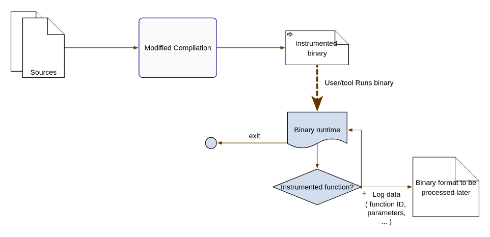
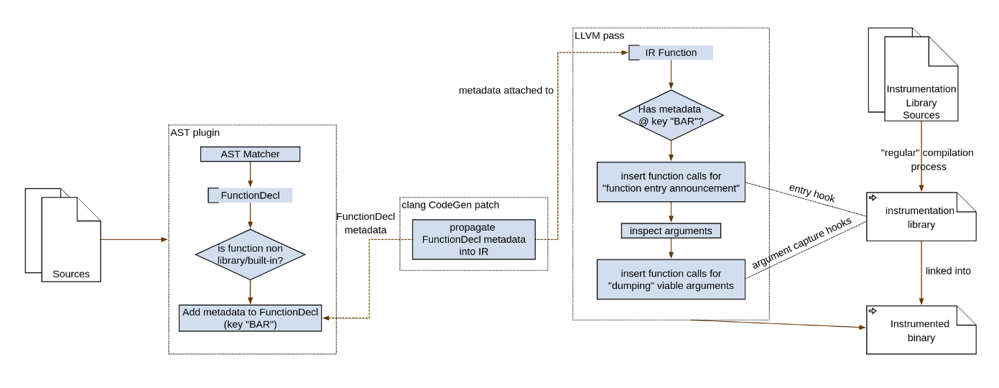
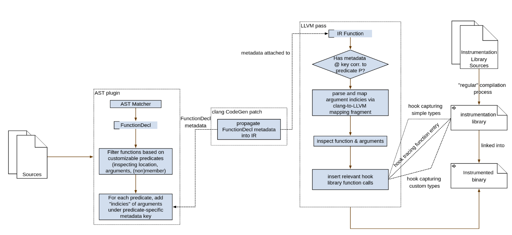
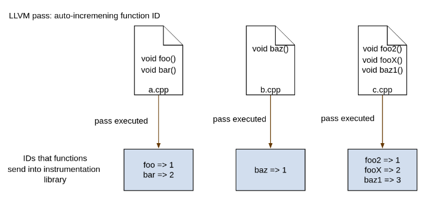
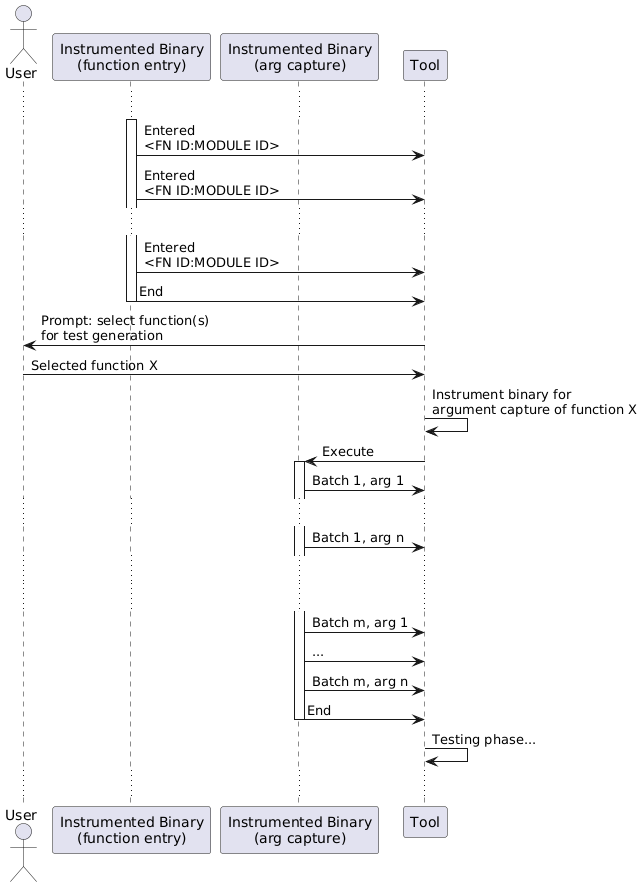
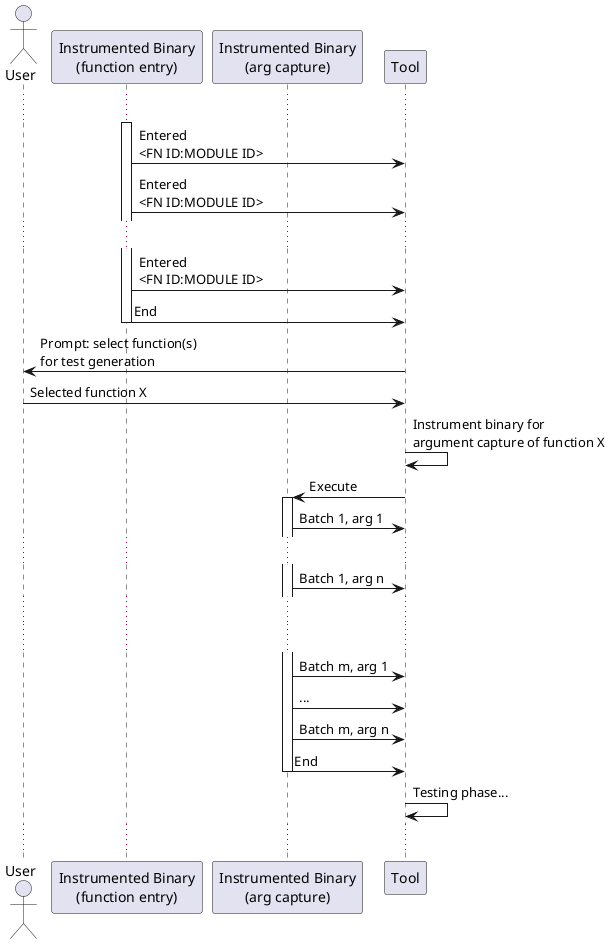

**Rough contents:**

* [C++ instrumentation ecosystem](#c-instrumentation-ecosystem)
* [Thoughts on Architecture](#thoughts-on-architecture)

**Progress updates (2025):**

* [end of March 2025](#update-end-of-march-2025)
* [April 14](#update-april-14)
* [April 28](#update-april-28)
* [May 19](#update-may-19)
* [June](#update-june)

# C++ instrumentation ecosystem

## Demands on the (instrumented) application

* should not modify itself 
* should not use advanced security features (shadow stacks, stack cookies)

## Static instrumentation

**Additional demands**: dynamically-loaded libraries disallowed

### Ideas:

1. Syntax tree manipulation
    * add recording framework (bunch of source files external to the compiled source)
    * inject recording skeleton (into the syntax tree of compiled source)
    * attempt to compile
    * [should be rare: resolve conflicts (clashes in variable names) & recompile]

2. LLVM IR manipulation

### Notes - syntax tree manipulation

GCC seems extremely complicated. Clang AST might be a good candidate, although it is also complex.
Will try on smaller example. 

#### CLANG AST : [talk - 2013 - about the AST](https://www.youtube.com/watch?v=VqCkCDFLSsc)

* syntactical objects have IDs -> used in ASTContext
* `makeFileCharRange`, `measureTokenLength`
* AST of template *definition* and *instantiation* available (but AST nodes can be shared!!!)
* interface: `RecursiveASTVisitor` - selective, no context - has to be retreived "online"
* clang `ast-dump` `ast-dump-filter` `ast-list`
* `clang -Xclang -ast-dump srcfile`


Progress: **sandbox-00-clang-ast** demonstrates how to inject code to a source-available project.

<details>
<summary>
Expand **Before**
</summary>

```c++
#include <iostream>

namespace __framework {

    class Reporter {
        public:
        template<class T>
        static void report(T val, const char* info) {
            std::cout << "recorded value: " << val << " " << info << '\n';
        }
    };
}
    

int int_called_with_int_float(int i, float f) {
    return i * f;
}


float float_called_with_double_int(double d, int i) {
    return d * i;
}

int everything() {
    return int_called_with_int_float(0, 3.2f) + float_called_with_double_int(4.4, 32);
}

int main() {
    return everything();
}
```
</details>


<details>
<summary>
Expand **After**
</summary>

(after minor formatting + addition of `__framework`)
```c++
#include <iostream>

namespace __framework {

    class Reporter {
        public:
        template<class T>
        static void report(T val, const char* info) {
            std::cout << "recorded value: " << val << " " << info << '\n';
        }
    };
}
    

int int_called_with_int_float(int i, float f) {
::__framework::Reporter::report(i, "i");
::__framework::Reporter::report(f, "f");

    return i * f;
}


float float_called_with_double_int(double d, int i) {
::__framework::Reporter::report(d, "d");
::__framework::Reporter::report(i, "i");

    return d * i;
}

int everything() {
    return int_called_with_int_float(0, 3.2f) + float_called_with_double_int(4.4, 32);
}

int main() {
    return everything();
}
```
</details>

TODOs:
* "reporting `__framework`" injection
    * solution: linked library, **major issue**: `#include` of the library header is needed for recompilation to succceed
* optionaly don't perform syntax/compilation checks? (for large projects)
    * no idea what exactly was meant by this...
* clang TOOL vs clang PLUGIN (use tool, recompile vs perfrom changes as a compiler pass)
    * semi-decided: LLVM IR pass seems better as the current AST modification would perform way too many risky operations
        * (syntactic) errors when rewriting the AST, preserving semantics of the language, ...

<details>
<summary>
Possible improvement via *Replacements* (**not used**)
</summary>

(see [link](https://github.com/jkelling/HIP/blob/100c8c83c1f54e4f78d50c64307b9e7083498da2/clang-hipify/src/Cuda2Hip.cpp#L906C1-L917C1))

```c++
  for (const auto &r : Tool.getReplacements()) {
    DEBUG(dbgs() << r.toString() << "\n");
  }

  Rewriter Rewrite(Sources, DefaultLangOptions);

  if (!Tool.applyAllReplacements(Rewrite)) {
    DEBUG(dbgs() << "Skipped some replacements.\n");
  }

  Result = Rewrite.overwriteChangedFiles();
```
</details>

**Setup**

    cd sandbox/00-clang-ast
    git clone https://github.com/llvm/llvm-project
    ./setup-llvm-build.sh
    ./setup-tool.sh
    ./build.sh

Important question of [**capturing program state**](#capturing-program-state) using the instrumentation.

## Dynamic instrumentation

### Pin

(quotes from Pin docs)

#### Limitations/requirements:

* x86-only
* debug symbols

<details>
<summary>
Pin issue that might be useful to know about later
</summary>
> There is a known limitation of using Pin on Linux systems that prevent the use of ptrace attach via the sysctl /proc/sys/kernel/yama/ptrace_scope. Pin will still work when launching applications with the pin command line. However, Pin will fail in attach mode (that is, using the -pid knob). To resolve this, do the following (as root):

    $ echo 0 > /proc/sys/kernel/yama/ptrace_scope
</details>


Major issue:

> Tools must refrain from using any native system calls, and use PinCRT APIs for any needed functionality.

> A C++ runtime. Please note that the current version **does not support C++11 and RTTI** (Run-Time Type Information).

#### Pin Instrumentation Granularity:

1. Trace - branchless instruction sequences (branching into a sequence means a new sequence is created)
2. Instruction
3. Image / Routine - image consisting of sections consisting of routines consisting of insns

Instruction & Trace - JIT
Image & Routine - AoT

>  the `IMG_AddInstrumentFunction` API call. Image instrumentation **depends on symbol information** to determine routine boundaries hence `PIN_InitSymbols` must be called before `PIN_Init`.

#### Tail calls

> Routine instrumentation utilizes the `RTN_AddInstrumentFunction` API call. Instrumentation of routine exits **does not work reliably** **in the presence of tail calls** or **when return instructions cannot reliably be detected**.

disabling tail calls:
* GCC: `-fno-optimize-sibling-calls`
* clang: `[[clang::disable_tail_calls]]`, `-mno-tail-call`, `-fno-escaping-block-tail-calls`


#### Function argument/return value access

Not supported by Pin directly - only symbol names.

1. Have Debug Symbols as a requirement, parse debug symbols using a library (`libdwarf`) & generate instrumentation based on the function's arguments

2. (C++-only) (**unreliable**) De-mangle function names to determine the function arguments & generate instrumentation based on it

#### Multi-threading

> Pin provides its own locking and thread management API's, which the Pintool should use. (and not regular system tools!) 

> Pintools on Linux also need to take care when calling standard C or C++ library routines from analysis or replacement functions because the C and C++ libraries linked into Pintools are not thread-safe.

> Pin provides call-backs when each thread starts and ends (see `PIN_AddThreadStartFunction` and `PIN_AddThreadFiniFunction`).

(Pin also provides) Pin-specific thread-local storage.

#### Logging

> Pin provides a mechanism to write messages from a Pintool to a logfile. To use this capability, call the LOG() API with your message. The default filename is pintool.log, and it is created in the currently working directory. Use the -logfile switch after the tool name to change the path and file name of the log file.

#### Problems

* collecting a stack trace (can we correclty capture a thread's ID? Can we access the stack trace? Do we even need the stack trace?)

* **capturing program state** for running a test (what is the mechanism?)
    - `-pin_memory-range` to contain Pin in a certain address range - may help woth reproduction
    - JIT mode

> On Linux IA-32 architectures, Pintools are built **non-PIC** (Position Independent Code), which allows the compiler to inline both local and global functions. Tools for Linux Intel(R) **64 architectures are built PIC**, but the compiler will not inline any globally visible function due to function pre-emption. Therefore, it is advisable to declare the subroutines called by the analysis function as 'static' on Linux Intel(R) 64 architectures.

(*irrelevant?*) How do we deal with this (PIE/non-PIE)? (dynamic object tree dump - IMO requires full instrumentation of all memory accesses inside every function call)

# Thoughts on Architecture

## Capturing arguments & return values

* to consider: if dealing with anything other than built-in types (primitives), would it even be possible to reliably (statically) instrument a function for return-value retreival?
    * returning a temporary uses things like copy/move elision, NRVO, ... (compiler-specific tricks for inlined functions, ...)
    * if we cannot reliably capture those kinds of objects, we would need dynamic instrumentation to inspect every single branch (linked call) **after** it happens, registering the returned value
    * this could boil down to just calling the proper ctor before a `return` 

Rough outline of a part of such capture:



## Capturing program state

Objects of interest, their inputs, outputs:

1. Free-stadning functions
* IN: arguments, global/thread-local state (possibly large object graph)
* OUT: retval, global state modification

2. Object methods
* IN: arguments, object graph (`this` and global/thread-local state)
* OUT: retval, object graph modifications (`this` and global/thread-local state)

`=>` both objects of interest need global/thread-local object graph for case reconstruction

`???` locks... program state may hold information on synchronization - process isolation inside a unit test may catastrophically interact with synchronization primitives:


1. N-threaded program (N > 1) running (on N threads)
2. Capture the state of thread X before executing fn `foo`
3. Generate unit tests, ...
4. Execute unit tests of function `foo` on a single thread

If `foo` e.g. waits on a barrier expecting N threads, N > 1. If `foo` does not spawn tasks on other threads that execute this same function, only 1 thread (unit-test thread) appears at the barrier, never finishing.

`???` IO/system resources - unit test (<- ?) should be testing a fairly isolated function

This implies two things: unit-test timeouts are needed, multi-threaded execution is hazardous for this approach and it is extra tricky to ensure OS resources (IO/networking, ...) are handled correctly by external unit test. 

Approaches for program state capture:

1. capture-all - probably simplest to implement but one with the ?most? runtime overhead
    * copy-on-write address space copy & attachment of unit tests into the addres space may help with performance costs (**this essentialy means `fork` or `clone`-ing the process BEFORE the function call is made / before the first statement of the function is (even partially) executed**)
    * full recreation of conditions may be impossible due to resource usage
        * additional approaches - networking/IO hypervisor
        * rule out the usage of "shared memory" or perform a blocking copy/toggle to non-shared in the forked process 
        * `clone` syscall enables greater granulalrity for controlling what gets cloned than `fork`
    * forked process would then call a memory-capturing funciton or get "deactivated"
    * "deactivated" process would wait for messages (IPC) with commands
        * for every command (e.g. function arguments and expected values), the process will be forked further, injecting/rewriting/using supplied arguments to continue function execution
        * furhtermore, in the forked process, the return statements will get replaced by saving a return value and sending it to the parrent process, this sequence terminates the child process (unit test executed, return value would be inspected in the parent)  
    * we have to prohibit recursive `clone` for any type of recursion (direct/indirect)
    * how to integrate (if possible, with a testing framework)
    * unknowns - never used `clone` - thread-locals? limitations coming from the parent process (`MADV_DONTFORK`)
2. capture-only-necessary - probably very lightweight but I think it is too difficult to pull off (library depdnencies, ABI, the inability to introspect C/C++ programs at runtime, statically dumping object representation may require arcane compiler knowledge, dynamic dumping presents the challenge of injection into a unit test - relocation of code, proper page mapping)

Simplified "forking approach" diagram:


### Discussion on `clone` method

#### Questions

* will static instrumentation be enough in this case, to implement all necessary steps?
* will the suggested solution be considered too invasive?
* in case it will be considered too invasive, is it possible to rewrite the entire function with a wrapper?
* 

<details>
<summary>
Idea of a `clone`-wrapper workflow
</summary>

```c++

int target(float arg) {
    // original funciton whose contents have been migrated to target__impl
    return target__test(arg);
}

int target__test(float arg) {

    auto params = receiveParams()

    for (auto&& param : params)
    {
#ifndef JOIN_STRATEGY
        sleep_if_too_many_clones_in_parallel(); //i.e. too many pending (not-received) results
#endif
        auto [child, is_parent] = clone_syscall(SETTINGS);
        if (is_parent) goto XXXX;

        float testArg = args.arg;
        int testRetVal = target__impl(testArg);
        
        auto result = evaluate(testRetVal, param.expected); 
        setResult(result, child);
        exit();
XXXX:
#ifdef JOIN_STRATEGY
        auto child_ran_too_long = child.join_with_timeout();
        if (child_ran_too_long) {
            REPORT_CHILD_RAN_TOO_LONG();
        } else {
            registerResult(fetchChildResult(child));
        }
#else
        childList.store(child);
#endif
    }

    // terminate without affecting optimizations (make sure code ends up here)
    return 0;
}

int target__impl(float arg) {
    // real implementation of "target"
    return 1;
}

```

</details>
 
#### Limitations

* `pin` might not be a viable candidate for this stage as it requires a syscall (`clone`)

## Other tools/references

* [traces](https://github.com/yotamr/traces) - static (`clang` plugin) "type-aware" funciton tracing
    * particularly [Architecture](https://github.com/yotamr/traces/wiki/Architecture)

* [gcc instrumentation](https://www.kernel.org/doc/html/v5.6/core-api/gcc-plugins.html)
    * [usage](https://www.codingwiththomas.com/blog/accessing-gccs-abstract-syntax-tree-with-a-gcc-plugin)

# UPDATE end of March 2025

## Implementation (issues with): AST rewriting

* initial prototypes looked promising
* when delving into finer implementation details, I discovered that the approach is, however, infeasable due to the following

1. `C` and `C++` discrepancy
    * altering syntax when targeting multiple languages requires syntactic rewriting to consider supoprted languages
    * this requires near-expert knowledge to be certain that modified programs won't be rejected by C and C++ compiler
    * passing arguments to our argument-capturing library, for example, could become a major issue when attempting to support more complex types
        * rule-of-five-type nuances
        * ensuring global uniqueness of possible temporary identifiers, ...
    * Templates are entirely unsupported due to the possibility of instantiations which take unsupported types as arguments (e.g `tempalte<class T> foo(const T& x)` and `foo<int>`, `foo<CustomWeirdClass>`)
        * this would either require specialization or compile-time magic to be injected to the template body, complicating the code modifications & rule adherence even further
    * NOT investigated (maybe TODO?): lambda support
        * how to visit with the AST Matcher
        * how to inspect - CAPTURED varaibles 

2. Clang's AST manipulation is not as flexible as expected
    * AST rewriting does not (to my knowledge) expose an API to "create" valid functions
    * moreover, deep return type inspection of functions omits qualifiers and return type deduction would probably also not yield any information
        * this mainly complicates the `clone` approaches' function duplication

3. Library Calls Require Additional risky step
    * for the modified source to be recompiled again, it must ensure the `#include` of a library header we would use to trace execution
    * this is impossible within the AST API, furthermore, adding `#include`s "wherever" is not safe
        * e.g. precompiled headers, some domain-specific requirements, ...

The current implementation instruments the sample (C++-only) code to "record" function entry/exit or function arguments (although with dodgy or outright dangerous syntax). The current AST instrumentation also leverages C++'s destructors to differentiate between "regular" returns and exceptions (as an exercise/in initial stages, it this has been a simpler way to track the function scope than inspecting and modifying `return` statements and possibly their vicinity - due to e.g. single-non-compound-statement `if (cond) return x;` ).

### Relevant source files:

* [library interface](../sandbox/00-clang-ast/inject-w-library/lib/include/funTrace.hpp)
* [AST rewriter](../sandbox/00-clang-ast/cpy-to-llvm-project/clang-tools-extra/ast-injection-with-lib/AstInjection.cpp)
* [test program - raw](../sandbox/00-clang-ast/instr-rapid-iter/test-program.cpp)
* to perform instrumentation, run either `ftrace-program-instr.sh` for function tracing or `program-instr.sh` for parameter tracing (in `sandbox/00-clang-ast/instr-rapid-iter/working` directory)

The only positive compared to a custom LLVM IR pass would be the ability to easily differentiate between built-in/library/`#include`d functions from "user" functions.

## Runtime overhead and possible speedup by recording in two passes

It might come in handy to perform a two-phase execution before test-case generation:
1. Run Function Tracing Instrumented code - generates simply put a list of called (and exited) functions
    * then let developer select a funciton whose input values should be recorded
2. Run Function Argument Recording Instrumented code - no user interaction needed
3. Run Function Unit-Testing code using recorded Arguments

This introduces a overhead of recompilation for each different function to be examined. Results could be cached though or the instrumentation could be "conditional" based on a function identifier.

## LLVM IR instrumentation

Approach similar to the AST rewriting: instrument functions & call to a runtime library.

### Relevant source files:

* [custom compiler pass](../sandbox/01-llvm-ir/llvm-pass/pass.cpp)
    * injects IR with various calls to our library
* [skeleton of a support library](../sandbox/01-llvm-ir/test-pass/hooklib/hook.c)
    * provides a simple interface as a proof-of-concept
* [code to instrument in C](../sandbox/01-llvm-ir/test-pass/test-program.c)
* [code to instrument in C++](../sandbox/01-llvm-ir/test-pass/test-program.cpp)

* [how to instrument the sample code and outputs for the instrumented code](../sandbox/01-llvm-ir/test-pass/working/HOWTO.md)
    * instrumented IR 

### Issues:
* library vs non-library functions
    * so far relies on specific mangling (unstable)
    * could be solved by passing aditional metadata from the previous compilation phase into the IR
* cannot distinguish between signed & unsigned integers - overall, support of types limited to LLVM IR types
    * could be solved by the same technique as above (exporting more metadata to the IR) - would introduce language-specific requirements
    * could be possible to write type-specific handlers of LLVM IR function parameters (e.g. a pointer to `std::string`, ...)

### Advantages over AST technique
* no messy `#include`ing - only linker errors
* no C/C++ syntax/type system/move semantics quirks and failure vectors
* no danger of being incompatible with certain language constructs
* generally more language-agnostic

# UPDATE April 14

* [public repo - mirror](https://git.bohdanqq.com/BohdanQQ/research-project)


## IR Metadata
* initial idea was to traverse AST and add metadata to functions
    * OK since IR metadata can be attached to module/function/instruction
    * inspection on AST level allows analysis of function arguments

* **did not** find a way to attach metadata to `FunctionDecl` (AST-level representation)

Remedies:
* a simple [patch](../sandbox/01-llvm-ir/custom-metadata-pass/custom-metadata.diff) to clang/llvm
    * add a method to `FunctionDecl` to **set** string key-value metadata pair 
    * plus a method to **fetch** the metdata later when constructing LLVM IR

* [AST plugin](../sandbox/01-llvm-ir/custom-metadata-pass/ast-meta-add/AstMetaAdd.cpp) walks the AST and injects metadata 
    * currently only the information regarding the location of a function

* modified [LLVM pass](../sandbox/01-llvm-ir/llvm-pass/pass.cpp) filters instrumentation based on metadata added by the AST plugin
    * former version of filtering (by detecting mangled `std::` namespace) available by passing `-mllvm -llcap-filter-by-mangled`

[Build & run scripts / working directory](../sandbox/01-llvm-ir/test-pass/working/)

* possible **limitaitons** (not investigated):
    * approach no longer a "drop-in", easy-to-use - metadata patch to clang/llvm needs recompilation of a core part (the AST -> IR step)
    * wrt. argument inspection - metadata only attached to a function - is it possible to reliably encode argument position? (that argument order remains the same in the IR as it was in the AST)
    * the AST inspection code might not correctly handle all functions (intricacies of the AST structure)
        * so far recursive namespace walkthrough + inspection of all lambda expressions (for their `operator()` - which is our desired function for in-code lambdas)

Diagram of the solution:



### Other findings

* [LLVM MLIR](../notes/02-mlir-notes.md)
    * seems like a dead-end?
    * idea: `MLIR` C/C++ dialect could be on a good abstraction layer for both AST-like inspection and insertion of LLVM metadata (the dialects eventually have to be transformed into IR in our case)

* [separate detailed document/tutorial on LLVM metadata](../notes/01-llvm-ir-metadata-emission.md)

* [a usless rabbit hole on a (de)mangling bug I encountered](../notes/0x-llvm-demangling.md)

# UPDATE April 28

## Argument order

Argument order remained a question in previous meeting. I attempted to tackle this issue in 2 ways.

1. **LLVM attributes**

Key observations:

* attributes are **tied to arguments**
* some are closely related to C++ attributes, some are generated and inserted into the IR

Attributes seemed ideal as a candidate for relaying information about funciton arguments to the lower levels of LLVM. Indeed, LLVM's `AttrBuilder` allows to add attributes to an argument index of a function (see [a diff that combines both metadata and attributes](../sandbox/01-llvm-ir/custom-metadata-pass/metadata-and-unsigned-attributes.diff)). The attributes' assigned positions, however, do not change when LLVM IR is generated (e.g. to shift by one due to the introduction of `this` pointer as an argument to member functions). I tried to search the LLVM codebase to see where
the mapping occurs but was unable to make it correct, reaching a dead end.

2. **Using metadata and a fragment of code from LLVM**

Of course, argument order and introduction of extra arguments is entirely dependent on the target architecture. As such, when experimenting with more and more variants of functions in [the C++ test program](../sandbox/01-llvm-ir/test-pass/test-program.cpp), I ended up discovering that **LLVM may return an argument "in a register" that is passed as an *output* argument** (indicated by IR `sret` attribute). When digging around for more ABI-specific details, I found a fragment of code (class `ClangToLLVMArgMapping`) that allows to map function arguments as seen in AST to their representations in LLVM IR.

This fragment is not "exported" in a header file, therefore - to minimize modifications to the LLVM codebase, I copy-pasted this fragment to the relevant part of source code, where I plan on converting the AST argument indicies to LLVM ones. Luckily, the already-modified area of `CodeGenFunction.cpp`'s `StarFunction` has all the required objects initialized and ready to be used.

One small caveat is that `ClangToLLVMArgMapping` does not consider `this` pointer in its calculcations for some reason.
This is mitigated in the AST plugin which has information about whether a function is a member or not. The AST plugin simply inserts marker metadata that the IR plugin reads. Looking around the LLVM codebase, I was unable to prove nor disprove the correctness of this approach.

**How**

In current version, the **AST plugin** (that so far only indicated whether a function is a library function or not) injects **AST indicies of arguments** we deem interesting (that we will inspect).
(technically, the indicies are encoded as string metadata, for each "kind of interest", we inject one string index list).

Later, in the IR generation phase (`CodeGen`), we inspect functions using the duplicated `ClangToLLVMArgMapping` class and attach anoter piece of metadata to the function, encoding:

- number of IR arguments
- number of AST arguments (let's denote `n`)
- mapping of AST arguments (`n` pairs, each pair indicating the IR index of the correspoding argument and how many IR arguments it spans)

### Span of an argument

Inside `ClangToLLVMArgMapping`, it is trivial to see that LLVM passes some larger arguments in multiple IR arguments. For example, the IR only supports what seems to be a 64-bit data type.
Thus, passing a single 128-bit value (such as a simple 128-bit integers), causes LLVM to generate IR that splits the large argument into two smaller ones in the IR.

I confirmed this is the case and due to this oversight, included the argument span metadata in the custom metadata that is passed later. For completeness, here is an example showcasing `sret` and large arguments:


```cpp
Large returnLarge(uint64_t x)

float bignum(__uint128_t f)
```

Translate as:

```
; notice sret

void @_Z11returnLargem(ptr dead_on_unwind noalias writable sret(%struct.Large) align 8 %0, i64 noundef %1)

; notice 2 arguments instead of 1

float @_Z6bignumo(i64 noundef %0, i64 noundef %1)
```

Example mapping:

```cpp
void pass128Struct(Fits128Bits s)
```

```
define dso_local void @_Z13pass128Struct11Fits128Bits(i64 %0, i64 %1) #0 !VSTR-NOT-SYSTEM-HEADER !7 !LLCAP-CLANG-LLVM-MAP-DATA !11

; two IR args, one clang-ast arg, the first clang arg is mapped to 0th IR arg (span 2)
!11 = !{!"2 1 0-2"}
```

**Later**, the LLVM IR pass reads the index mapping as well as the "interesting" index lists to produce correct hook calls for the correct arguments. Current implementation should handle **this pointer**, **sret return values** as well as **multi-IR-argument-spanning data**. 


[A reduced diff, showcasing the functionality](./misc/clang-ir-index-mapping.diff)

[A full diff that has to be applied](../sandbox/01-llvm-ir/clan-ir-mapping-full.diff)

## Sketch of a custom type support

The need for argument order tracknig comes from the need to propagate *signedness* information from the AST phase into the IR phase. This goal is akin to a more general problem already discussed: *custom/library types support*. As a demo, the current version outlines a way to support more complicated types, namely `std::string` (concretely `std::basic_string<char>`). The process is thus:

1. Modify AST plugin to emit additional argument index metadata under a custom key `K`
    * the metadata encodes position of a type `T`
2. Add a function to the hook library, that accepts a pointer to `const T`
    * extra care is presumably required in this step 
3. Match the metadata `K` (index list) and emit a call to the newly created hook function

Treating references (`&` and `&&`) as pointers on the IR level surprisingly worked, though I have not proven that this approach is entirely correct. One obviously should avoid non-const access to a value of `T` in the hook library function.

As more and more technicalities appeared while working on this issue, [the C++ test program](../sandbox/01-llvm-ir/test-pass/test-program.cpp) has been accordingly updated with string functions, `sret` functions and functions accepting/returning wider types (`__int128`).

Example:

```cpp
// new hook lib function that gets injected (stdstring8 only displays "std::string" next to its value)
void vstr_extra_cxx__string(std::string *str) { hook_stdstring8(str->c_str()); }

// in test program:
template<class T>
T templateTest(T x) { return x; }
```

`std::string` instantiation of this template translates into IR as:

```
; notice sret
; new metadata key: VSTR-CXX-STD-STRING

define linkonce_odr dso_local void @_Z12templateTestINSt7__cxx1112basic_stringIcSt11char_traitsIcESaIcEEEET_S6_(ptr dead_on_unwind noalias writable sret(%"class.std::__cxx11::basic_string") align 8 %0, ptr noundef %1) #0 comdat !VSTR-NOT-SYSTEM-HEADER !7 !LLCAP-CLANG-LLVM-MAP-DATA !12 !VSTR-CXX-STD-STRING !13

; mapping considers sret argument
!12 = !{!"2 1 1-1"}

; the first **AST** arg is string (the first IR arg is sret argument!)
!13 = !{!"0"}
```

Refined AST + LLVM pass interaction accounting for argument indicies shift:



## IPC fundamentals, architecture considerations

The idea I had was that the instrumented application would call to our hook library functions that could facilitate the IPC with a "server" application. The "server" application would be able to perform 3 functions:

1. capture function call data (by reading only from the IPC stream)
2. capture and store function arguments of target functions
3. provide argument data from recordeded functions

The immediate reason for using IPC was to avoid bottleneck hardware (disks) by writing intermediate results to a filesystem. This presented a challenge in the way functions are identified: LLVM plugin is launched once per "module" (imagine a `.cpp` file) and functions provide no real way of identification. The **uniquely**-identifying information seems to be the *function's name combined with the identifier of the module the function resides in*.

Resulting function ID mapping if module IDs are not considered (demonstrative):



### Unique function identifiers

The idea is that the user will identify a function(s) to instrument after a call-tracing pass, which means that the hooking library (that exports information to the "server" and by extension its user) needs to receive the function IDs. (aside: in addition to this, we still in need to uniquely identify functions for the "test generation" phase, as we will need to instrument "the correct" function)

Sequence diagram of the envisioned interaction:


<details>
<summary>
Click for plantuml source
</summary>



</details>


Further, in order to simplify the later implementation of an IPC protocol, the module ID (absolute path to the module) is translated to a **fixed-size** hash (SHA256 - an ad-hoc choice as the hash function is present in the interface exposed to plugins).

A desirable refinement would be to generate simpler (shorter), integer-based IDs. This presents the following challenges:

1. plugin has access to only one module at a time, a global data store would need to be established either via LLVM's interface or e.g. filesystem (to investigate)
2. for filesystem-based approach, we need to ensure proper ordering
    - either we run two separate compilations (insane for larger codebases)
    - or we must ensure that two plugins are dependent on each other (the module ID reduction must happen first)

In the current version, instrumentation creates a file for each "module" in a predefined folder. File names correspond to module hashes and contain the module name and mapping of function IDs to function names.

### Initial demos and program crashes

Initially I chose to work with existing solutions and got as far as implementing a working server
prototype that received information from the ipc-enabled hook library about the functions called
by the target program.

#### Initial positives and negatives considered

* (+) support for more languages (than C/C++)
* (+) features implemented
* (-) features "planned"
* (-) requires a "broker"

At the very beginning, `iceoryx2` and `zeroMQ` were considered.
I chose `zeroMQ` as its documentation seemed more accessible (man-page style).

#### ZeroMQ communication and the termination issue

> [!note]
> This approach was abandoned. The relevant revision for ZeroMQ functionality should be `452eee59431e8a3c7797dd9213c0e329fff208c6`. At that point the `llcap-server` should support the `zeromq` positional argument to use ZeroMQ for call tracing.

ZeroMQ is an IPC middleware that supports a variety of programming languages and provides a lot of architecture modes. I chose a push/pull mode: instrumented application pushing identifiers, server pulling them. The hook library additionally has a `__attribute(constructor)` initialization and (`destructor`) deinitialization routines to prepare/close everything on start/exit. This feature is very useful, as we simply always require at least some form of initialization of our library. Especially the `constructor` attribute is used in all later versions of the hook library.

The ZeroMQ implementation "works", as in, the correct function IDs are being received. **That is as long as the target program does not crash**. In my experiments, I've always played with, tested and *considered non-crashing programs*. When programs crash, they leave their environment abruptly; not all signals allow cleanup time even if an application handles signals. When a crash is introduced to the test program, there are times when the ZeroMQ push channel does not flush
the buffer towards the pull side and its contents (a few function calls) are lost.

I was unable to find a way to ensure proper flushing. One of the attempts resulted in the creation of the [`ipc-finalizer`](../sandbox/02-ipc/ipc-finalizer/) application which is supposed to be executed after the target program crashes in order to connect to the IPC channel and send a *session-terminating* message to the [`llcap-server`](../sandbox/02-ipc/llcap-server/) (the binary on the other side of the IPC connection). 

Ulitmately, the `llcap-server` relies on the *terminating* message in order to progress. This however, can be bypassed by letting `llcap-server` monitor the instrumented program via either launching it itself or probing the system.

Unfortunately, `ipc-finalizer` did not resolve the issue. The experiment is thus left in an awkward state between being capable of running and demonstrating the ideas, yet absolutely failing to reliably cover the intended usecase: tracing execution of crashing programs.

Other approaches considered (only covering the detection of termination, not message flushing):
* timeout - too unreliable, especially annoying for long-running code
* user interaction - capture messsages on one thread, poll for user input on other, wait for the first thread that reports progress (termination or user input requesting termination) and kill the other thread

Relevant files implementing this approach:

> [!note]
> The following paths are relevant in revision `452eee59431e8a3c7797dd9213c0e329fff208c6`

* ZeroMQ integration to hook library
    * at `/sandbox/02-ipc/ipc-hooklib/ipc.c`
* `llcap-server`'s `zmq_capture` module
    * at `sandbox/02-ipc/llcap-server/src/zmq_capture.rs`

The target test project for the IPC approach is the [example-complex](../sandbox/02-ipc/example-complex/). This is the familiar test program compiled with another cpp file and managed by `CMake`. Inside the `CMakeList.txt` file, you can switch between the approaches. The [`build.sh`](../sandbox/02-ipc/example-complex/build.sh) script builds the binary with our custom compiler passes.

Crashing is enabled by simply passing 3, 2 or 1 argument to the compiled binary. Each triggers a crash as the first (3 args), second (2 args) or "later" (1 arg) statement in `main`. If no arguments are given, application terminates properly.

##### Technical note - build.sh

The script calls `cmake` twice. This is because `cmake` fails compilation test of a "test C program" due to the usage of relative paths for `clang` options that import our plugins.

Further, `ninja install` in LLVM build directory is required.

##### Choice of Rust for `llcap-server`

* is cool
* argument parsing familiarity (`clap`)
* provides C interop
* comfortable type system
* comfortable build system
* tooling
* **risk**: library availablility

#### Shared memory approach

After the [ZeroMQ approach failed](#zeromq-communication-and-the-termination-issue) due to buffering issues when a program crashes (crucial property of our usecase), I realized that even the filesystem-based approach would suffer from similar issues in the area of output buffering. In this case, we would rely on the kernel/library to properly flush a crashing program's buffers onto the disk.

Another option is using and managing shared memory ourselves. This can 
- reduce the bottleneck potential by avoiding output flushing on a disk
- provide a way to capture all the data up until the point of the crash
- provide a general IPC method for the purposes of the entire application

For now, all we need in our communication (for function call tracing) is:

1. Rendezvous between the instrumented process and `llcap-server` at the beginning to establish parameters (buffer size)
2. Implementation of an IPC single-consumer-single-producer protocol via semaphores and a shared buffer

For this, I decided to utilize named-semaphores and "named" shared memory regions (`shm_open`, `sem_open`, `mmap` syscalls etc.).
In the current version, `llcap-server` initializes 2 semaphores (indicating a *free* and a *full* buffer) and 2 memory regions (a "meta" region and "buffers" region).

The "buffers" region contains `N` buffers, each of length `L`. The "meta" region contains the initial communication parameters (number, length and total length of buffers). It is expected the `llcap-server` **runs first** to initialize the memory mappings and only then can the target application be started.

The target application maps the created memory regions and "opens" the semaphores. As of April 27th, the functionality includes correct memory mapping and opening of semaphores (no interaction yet).

Files implementing this approach:

* [`shm.c` of the IPC hook library](../sandbox/02-ipc/ipc-hooklib/shm.c)
* [`shmem_capture` module of `llcap-server`](../sandbox/02-ipc/llcap-server/src/shmem_capture.rs)

##### Rough outline of the protocol

`N` buffers are being cycled in a round-robbin. First, producer writes to the first buffer, after filling it up, it writes the number of valid bytes inside the buffer to the buffer start and signals to the consumer (via the `full` semaphore) that a buffer is ready.
Consumer processes the buffer. Meanwhile producer moves onto another buffer by waiting on a `free` semaphore and modulo-incrementing the current buffer index.

*Limitations* will be imposed on buffer size and message size. 
* An empty buffer signals to the consumer that no more data is available. This relates to the `ipc-finalizer` which, in this model, would connect to the relevant semaphores and buffers and simply send an empty buffer to indicate the end of data collection. 
* A *message cannot be split* in this model, thus a message shall always fit in a buffer.

# UPDATE May 19

## Call tracing finalization & bugfixes

* removal of ZMQ from all layers

### Module ID Shrinking

* 64B SHA 256 was collapsed (XORed) to a 4B ID
* these (in hex form) are used as filenames -> check for collisions via exclusive creation of such files

### Final form of the protocol

* new termination sequence 
    * N buffers => after at least 2N - 1 zero-length payloads, all buffers are cycled
    * termination sequence sends 2N zero-length buffers (signals 2N times on the "full buffer" semaphore)

## Receiving function arguments

### Encoding

* see [TODOs](./000-TODOs.md#capturing-function-arguments)
    * `Preamble`(Module ID, Function ID), Arg1, Arg2, ....
    * argument sizes exported in the first phase of `llvm-pass`
* implementation in hooklib
    * pointer alignment may be disrupted => before sending Preamble.ModuleID, we enforce alignment
    * otherwise we just push data
* consumers on `llcap-server` only capture binary data of certain size
    * for dynamically sized payloads, we will rely on length-payload encoding
    * so far support for fixed-size arguments of size up to 16B + null-terminated strings of bytes
* the idea is that the data will be duplicated "as received" to the tested application later
    * as we inject argument *capturing functions*, we will inject argument *requests* that expect the same format as serialized by the capturing functions 

### Storage

* influenced by the needs of the testing phase
* packet size important, individual data size not important

## Hijacking arguments in the testing phase

* constness - [TODOs](./000-TODOs.md#topic-modification-of-incoming-arguments)

### Possible improvements

* just thoughts, **most of those are pretty extreme**
* multithreaded capture processing
* utilizing automated C header -> Rust code conversion tools (for comms metadata/parameter region)
* using debug information inspection to generate argument index conversions
    * seems like `sret` detection will require looking at attributes instead of debug metadata
    * `this` pointer differentiated by "artificial flag" in debug info
    * would probably eliminate the need for the [LLVM modification that allows to manipulate function metadata](../sandbox/01-llvm-ir/custom-metadata-pass/custom-metadata.diff)

#### Performance thoughts

* nontemporal x86 mem store instructions (bypassing the CPU cache)

* multithreaded `llcap-server` possible for capture processing
    * queueing only has to ensure that `free` semaphore signalling follows the buffer index order
* avoiding

#### Overhead thoughts

* reducing multiple-compilation overhead by adjusting instrumentation to instrumenting for "tracing and caputre at the same time"
    * merge the functionality an add a runtime branch (`if (s_capture_mode == CAPTURE_CALL) { ..capture calls.. } else { ..capture args/run test.. } `)
    * maybe branch predictors will help us? (can we help the branch predictors ourselves?)

# UPDATE June

**Incredibly relevant** 2025 EuroLLVM talk: [Pass Plugins: Past, Present and Future](https://www.youtube.com/watch?v=pHfYFGVFczs)
