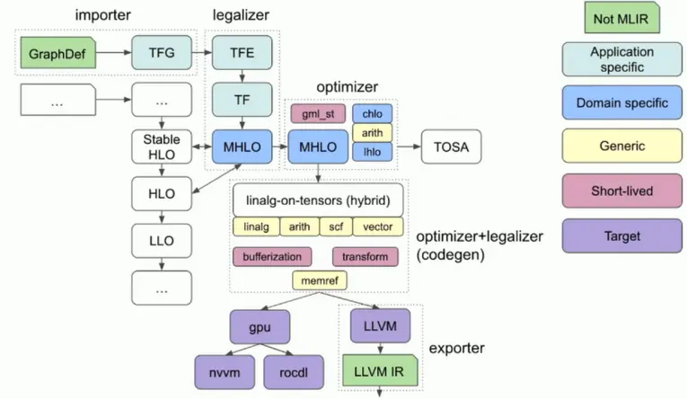
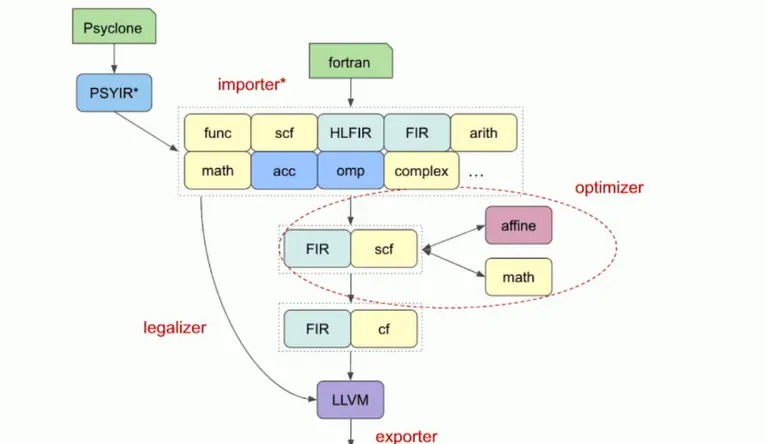
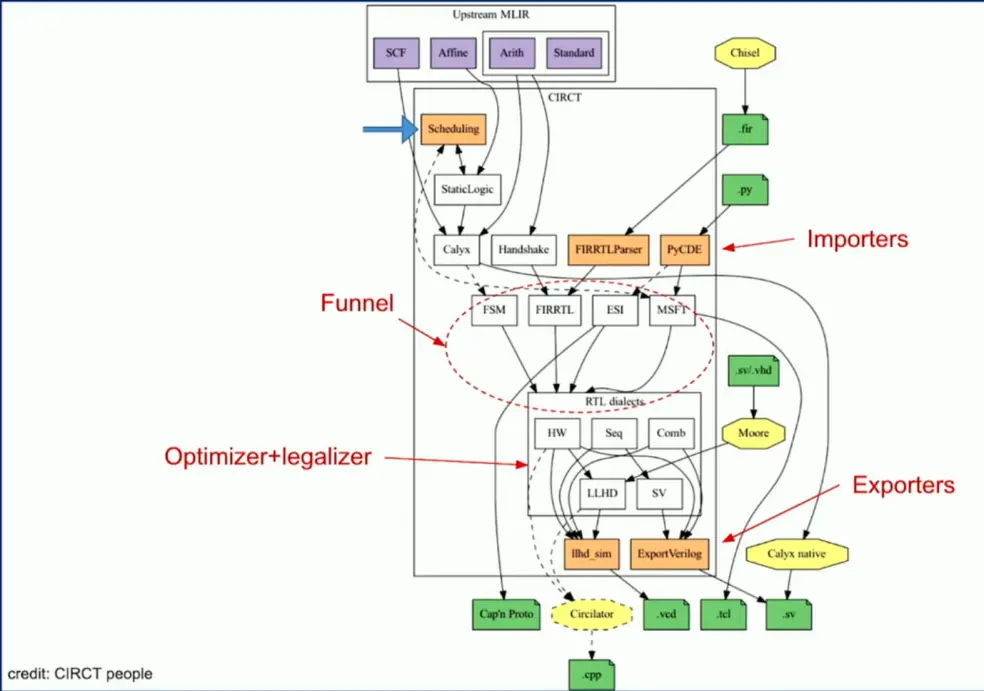

# Intro, resources

* [2023 LLVM Dev Mtg - MLIR Is Not an ML Compiler, and Other Common Misconceptions](https://www.youtube.com/watch?v=lXAp6ZAWyBY)
    * [slides](https://llvm.org/devmtg/2023-10/slides/techtalks/Zinenko-MLIRisNotAnMLCompiler.pdf)
* [2023 EuroLLVM - MLIR Dialect Design and Composition for Front-End Compilers](https://www.youtube.com/watch?v=hIt6J1_E21c)
* [MLIR Tutorial: Building a Compiler with MLIR](https://users.cs.utah.edu/~mhall/mlir4hpc/pienaar-MLIR-Tutorial.pdf)
    * practical, I recommend going through this after reading this document
    * [Toy Tutorial](https://mlir.llvm.org/docs/Tutorials/Toy/)
* [MLIR dialect for C/C++ based languages](https://llvm.github.io/clangir/)

## MLIR dialects

* intermixed inside MLIR
* no clear dialect to go from and to
* has 2 built-in operations
    * and 10 types
    * and upstream dialects
        * "standard" dialect - broken down to 11 dialects
* we can apply transformations - passes - to MLIR, later lowered to LLVM
    * lowering passes - MUST occur
    * test passes
    * optimization passes
* interfaces on operations
    * allow bufferization, other optimizations
    * allow lowering to LLVM/CUDA
* "Dialects are powerful enough that you can wrap LLVM IR within an MLIR Dialect"

### MLIR compiler components

**The importer**
- simplifies importing data (from bytecode, a graph sctructure, ...)

**The funnel**
- funneling inputs into a common representation

**The legalizer** -> **The optimizer**

**The specializer**
- e.g. CUDA version dialects, ...

**The exporter**
- e.g. the LLVM

Tensorflow example:

Fortran Example:

CIRCT Example (a !hardware!-design platform)

### Dialects

* a building block
* namespaces for attribtues, operations and types
* dialect `hooks` and `interfaces` inform MLIR how to thread dialect's operations
* library API design <=> dialect design
* can consist of other dialects (typically sharing typesystem)
* some dialects can dissapear (be used only for e.g. optimization passes)

**Characteristics**
* contracts over attribtues, operations and types
* tradeoffs!
* important to understand the context (how the dialect interacts with other dialects)
* types are more important than operations (harder to evolve them)

**Patterns**

- **input** dialects - captures program semantics, no loss of relevant information, structure similar to its input (can also be output `spirv`)

- **hourglass** dialects - looking up & down (like a compiler in general) - abstracts over representations, exposes *majority* of platform capabilities via IR

- **optimizer** dialects - concise abstractions over concepts that we optimize, typically one operation per concept, designed for transformability

- **computation** dialects - exposes numerical capabilities of an abstraction layer, each operation self-contained capability, no overlap between operations, at least 1:N lowering (*"you don't need 2 ops to lower 1 op")

- **paradigm** dialects - implement a structure of a programming model, concise representation of pgm. model concepts, easy to compose with computation dialects, `<=` 1 op per concept, "glue" ops for generic ops (e.g. `async` - multiple dialects in one)

- **output** dialects - exposes capabilities of an external format, strict rules (target specificaitons, ...), accessing all capabilities of the external format, higher or same level of abstraction

- **meta** dialects - part of the compiler with MLIR IR itself, properly exposing MLIR constructs (`PDL`, `IRDL` `transofrm`)

- **glue** dialects - binding other dialects together (`built-in` dialect), dialects can interop, small interface of types & ops
