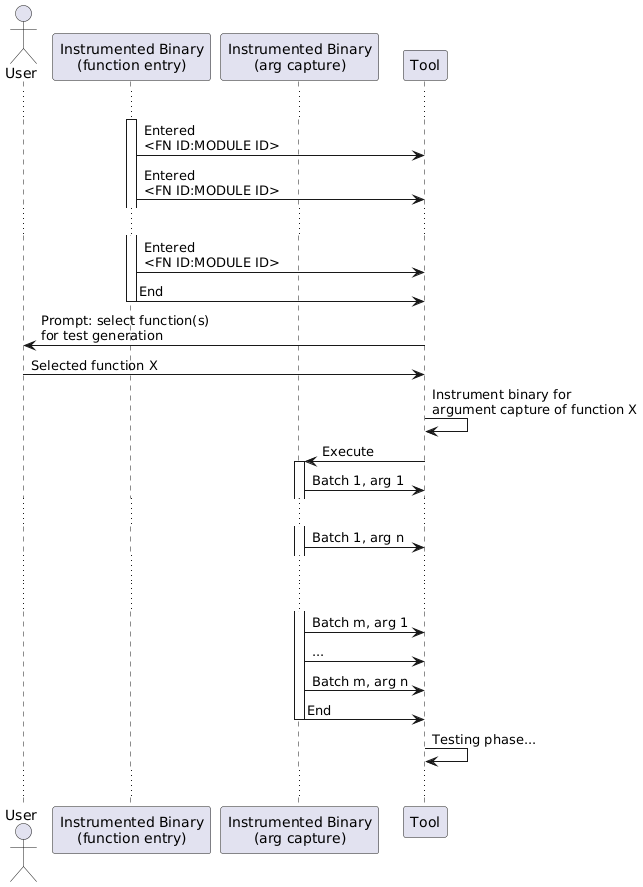

# `llcap-server` - experimental test driver

## Build

The build depends on a "shared memory metadata struct" that can be found in the hook library's [shm_commons.h](../ipc-hooklib/shm_commons.h) file. If this file's location does not match (relatively) to this folder, you need to modify the (`header` call in the) `build.rs` file. 

For usage examples, use `--help` or refer to the [demo](../example-arg-replacement/README.md).

## Development documentation

### Structure

#### the `src` directory

* `*.rs` files - top-level drivers, constants, logging, CLI argument declaration
  * `modmap.rs` - module mapping parsers (file generated by the LLVM plugin) and manipulation of the module mapping data, *central* for all stages
  * `sizetype_handlers.rs` - simple binary readers used to consume data from argument capture streams (prescription of handlers is encoded in the module mapping file generated by the LLVM plugin)
        * currently supported: `fixed-sized` (0-16B), `cstring` (null-terminated), `std::string` (captures capacity, size and contents)
* [`libc_wrappers`](./src/libc_wrappers/) - wrappers around libc semaphores, shared memory, ...
* [`shmem_capture`](./src/shmem_capture/) - contains infrastructure code for testing stages (call tracing, argument capture, testing), cleaup functions as well as utilities for working memory according to the protocols required to communicate data between the `llcap-server` and the instrumented application
  * **NOTE** that the module also contains the `hooklib_commons.rs` file which "`include!`"s a **`bindgen`-generated** file (one of the `hooklib` header files) and contains constants shared with the hooking library as well as a common data type (for conveying metadata information between the `llcap-server` and the `hooklib`) 
* [`stages`](./src/stages/)
  * helpers, import & export functions for call-tracing, argument-capturing and testing stages

### Build dependencies (bindgen)

* the [shm_commons.h](../ipc-hooklib/shm_commons.h) header file is **required** for a successful build

### Architectural details

Before reading, make yourself familiar with the [terminology and concepts](../../../README.md#concepts) of the project.

#### File formats

This section lists the non-trivial file(s/structures) used by this project. The information can be used to develop additional tooling, debug the application, inspect the generated artifacts, or even modify them.

##### Module mapping

The Module mapping directory is generated by the [LLVM pass](../../01-llvm-ir/llvm-pass/) and its path is customizable by passing `-mllvm -llcap-mapdir <path>` to the plugin.

The module mapping files are used by the `llcap-server` for mapping function identifiers to user-readable names and to guide argument extraction and hijacking workflows.

The directory contains one file for each module (e.g., a `.cpp` file). The filenames are derived from the module's ID. The contents are "lines" (delimited by `0x0A` with tailing `0x0A`) whose contents are to be interpreted as *strings* unless specified otherwise. 

The first line contains the string representation of the module ID as provided by LLVM. All other lines contain a *function record*, one per line.

A *function record* is a `0x00`-separated (without tailing `0x00`) list of:

1. Function name
2. Function ID (within the given module represented by the file, to be used as a *32-bit unsigned integer*)
3. *Argument Spec List*

*Argument Spec List* is yet another `0x00`-sperarated list of:

1. The number of arguments (denoted `n`)
2. `n` numbers corresponding to the values in the [llvm-pass/src/typeids.h](../../01-llvm-ir/llvm-pass/src/typeids.h) file (specifically the underlying values of the `LlcapSizeType` enum)

Throughout the project, we use the terms **function** and **module** ID. The function ID and module ID pair serves as a **unique** identifier of a function (function UID). Most of the instrumentation and processing refer to the UID in its raw form - a pair of 32-bit unsigned integers.

##### Recorded argument packets' directory

The argument packets (one set of arguments used to call an instrumented function) recorded by `llcap-server` are saved in the specified `out-dir` directory when performing argument capture.
The directory is divided into subdirectories corresponding to the module identifiers (name of the module's [module mapping file](#module-mapping)). In a subdirectory, each file corresponds to the function's 32-bit ID (in textual little-endian hexadecimal representation), and packets captured inside that function are stored in this file.

The contents of the file depend on the function's *Argument Spec List* as parsed from the [module mapping file](#module-mapping). Generally, the file contains, *in binary form*, a sequence of argument packets (until the end of the file). Each such packet has the following simple structure:

1. 4-byte little-endian `len` field
2. `len` bytes of *entire* packet data

This file is later used to supply argument packets to the program running in testing mode.

*note:* knowledge of the format **and** [argument (de)serialization](../../../notes/development-manual.md#deserialization) allows manual modification of the recorded values.


#### Communication with the instrumented program (target)

Our instrumented program (target) calls the [`hooklib`](../ipc-hooklib/) to connect, send, and receive data from the `llcap-server`, which drives the entire process. To do this, both components must agree on 
the parameters of the communication. We do this by using shared memory synchronized by semaphores.

##### Comms parameters shared memory region

We share a region of memory populated with the `ShmMeta` structure defined in [`shm_commons.h`](../ipc-hooklib/shm_commons.h) from `llcap-server` with the `hooklib`. The shared memory region is a named resource created by the `llcap-server`, synchronized by 2 semaphores. The names of the resources are also defined in the [`shm_commons.h`](../ipc-hooklib/shm_commons.h) file. The `llcap-server` is written in Rust, and bindings to the C header file are generated by the `bindgen` crate (see [build.rs](../llcap-server/build.rs)).

##### Capturing data from the target

In the call tracing and argument capture stages, the `llcap-server` reads data generated by the target. We again utilize shared memory and semaphores, this time by allocating `nbuff` buffers of size `buffSize` in one `nbuff * buffSize` mapping.

The buffers form a circular buffer structure, where the target produces (fills) a buffer and `llcap-server` consumes (reads) it and recycles it back, knowing that the next buffer's index is `( current_index + 1 ) % nbuff`.

Each buffer is a simple structure consisting of 

1. a 4-byte *bumper offset*
2. *payload* 

The *bumper offset* indexes into the *payload* and when a buffer is received by the `llcap-server`, the bumper's offset points to the **end** of the data (meaning that it is the first *out-of-bounds* byte of the *payload* part of the buffer), so `llcap-server` may treat it as the byte length of the payload.

###### Details

In more detail, we use the [comms parameters](#comms-parameters-shared-memory-region) and two accompanying semaphores to synchronize the buffer reuse. We define a `full` and `free` semaphores, signaled by the target and `llcap-server` respectively. The idea of using more than one buffer mitigates stalls due to processing of a buffer on the `llcap-server`'s side. The writing process appends to the buffer and increments the *bumper offset*. As a precaution, once `llcap-server` finishes reading a buffer, it will set the *bumper offset* to zero before signaling the `free` semaphore.

There is no explicit terminating condition to the communication itself (the `llcap-server` can and should wait indefinitely for a new buffer to process up until the application is dead), the `llcap-server` waits for the target to terminate and then sends the "termination sequence" - a sequence of `nbuff * 2` buffers whose size is zero. This ensures all buffers are processed (cycled) by the `llcap-server` even in the case of the target crashing.

The "termination sequence" is also implemented in the [`ipc-finalizer`](../ipc-finalizer/) tool for debugging and manual management of the target process.

##### Providing argument values to the target in testing mode

During the testing mode, `llcap-server` has to send the recorded argument packets to the target
so that `hooklib` code can perform the argument replacement. 

When the testing phase runs, there can be up to 3 entities running that we care to distinguish: 

* the `llcap-server` - monitoring the child process that is being tested
* the target - the [test coordinator](../../../README.md)
* the target - the fork launched by the coordinator, performing the argument replacement

To replace arguments in the fork, we therefore need to establish the following bi-directional links:

* `llcap-server` - test coordinator
* test coordinator - forked child 


###### Coordinator-fork communication

We first consider the inner-most link, within the target itself, we assume the coordinator-`llcap-server` link exists. The test coordinator spawns and monitors the fork, and we also chose the coordinator to maintain the link between these two parts of the system.

Inside the [`perform_testing`](../ipc-hooklib/hook.cpp) function, we use the `socketpair` API to create both ends of the communication channel, one used in the fork, the other in the coordinator.

The coordinator then polls the socket (with a timeout to allow other monitoring tasks to run) and reacts to a message. Currently, only the following protocol is implemented:

1. Fork "initializes" by sending an 8-byte unsigned "packet index" - the index of the packet which will be used to replace the arguments of the current call (available from the [comms parameters](#comms-parameters-shared-memory-region))
  * this also serves as a notification to the coordinator that the fork has successfully progressed/started
2. Coordinator reacts to the payload by reading it and delegating the index to the `llcap-server`
3. Coordinator waits for the response of the `llcap-server`
4. Coordinator sends the size of the received argument packet as a 4-byte unsigned integer to the socket, followed by the argument packet
5. Fork waits for the coordinator's response, reading the size, allocating sufficient buffer, and reading the argument packet into it

At this point, no further direct communication will be performed between the fork and the coordinator. The fork initializes the `hooklib` machinery responsible for the argument replacement and execution continues while the coordinator monitors the child process.

###### `llcap-server`-coordinator communication

This communication channel must deal with the more separated IPC mechanisms (compared to `socketpair`), as well as different types of messages (the argument packet request and the test status reporting for example).

We use Unix Domain Sockets with the shared name `TEST_SERVER_SOCKET_NAME` defined in the [shm_commons.h](../ipc-hooklib/shm_commons.h) file. The `llcap-server` listens for new connections, and each time a new connection is made, a separate async task is launched, handling that particular
test coordinator's messages.

The high-level message format is represented by the following Rust types:

```rust
struct CallIndexT(u32);
struct PacketIndexT(u64);

/// message received from the test client (test coordinator)
enum TestMessage {
  /// test started
  Start(NumFunUid, CallIndexT),
  /// test requested argument packet (payload is the packet index)
  PacketRequest(PacketIndexT),
  /// test (testing a packet index) ended with a status
  TestEnd(PacketIndexT, TestStatus),
  /// entire test session ended
  End,
}

enum TestStatus {
  Pass,
  Exception,
  Timeout,
  Exit(i32),
  Signal(i32),
  /// an unexpected test failure outside the sandboxing and monitoring of the test coordinator
  /// - could be a test coordinator crash or a test job crash
  Fatal(String),
}
```

The low-level view of a message is thus:

* length: variable, maximum 16B
* format: `| OUTER_TAG: 2B | payload: variable, max 14B |`

The `OUTER_TAG` values correspond to the tags listed in  [shm_commons.h](../ipc-hooklib/shm_commons.h), namely `TAG_START`, `TAG_PKT`, `TAG_TEST_END`, and `TAG_TEST_FINISH`. These correspond to the variants of the `TestMessage` enum above.

Based on the `OUTER_TAG`, the `payload` can contain:

* `TAG_TEST_FINISH` - nothing
* `TAG_START` - 4B module ID, 4B function ID, 4B call index
  * notice that call index is **not** a packet index
* `TAG_PKT` - 8B packet index
* `TAG_TEST_END` - 8B packet index and a *test status*

Test status then is of the following form:

* length: variable, maximum 6B
* format: `| TAG: 2B | status: 0-4B |`

Again, based on tags (the rest of the `TAG_*` items in [shm_commons.h](../ipc-hooklib/shm_commons.h)), the contents are as follows:

* `TAG_SGNL` - 4B signal code
* `TAG_EXIT` - 4B exit code
* `TAG_TIMEOUT`, `TAG_FATAL`, `TAG_EXC`, `TAG_PASS` - empty


The protocol always begins with a connection and a `Start` message. This establishes the client function (module ID and function ID to which we mapped the previously [captured arguments](#recorded-argument-packets-directory)). Sometime later, we expect either the `End`, `TestEnd`, or a `PacketRequest` message (followed by `End` or `TestEnd` later). The `llcap-server` reacts to the `PacketRequest` message by looking up the required argument packet and sending it back to the test coordinator in the 4B-length + payload format. 

For more detail on the message parsing/handling, consult the [`testing.rs` file](./src/stages/testing.rs) or the [`hooklib`](../ipc-hooklib/) for the `llcap-server` and instrumented application side respectively.

#### Detail of the interactions during individual phases

For a high-level overview, refer to the [high-level phase description](../../../README.md#phases).

##### Call tracing

The goal of the phase is to trace all executed functions in the instrumented program. The output of the phase is the *function selection* used during instrumentation for argument capture and testing.

This file is again, in format similar to module mapping: a `0x0A`-delimited (with trailing `0x0A`) that contains on each line the following `0x00`-separated items in *(decimal) string* representation:

1. Module LLVM identifier as provided by LLVM (from the module mapping)
2. Module ID corresponding to the LLVM module ID - as used by the project (parsable into 4-byte unsigned integer)
3. Function name as demangled by LLVM
4. Function ID corresponding to the function within the module (used by the project, parsable into a 4-byte unsigned integer)

The instrumentation is trivial: we insert a function call to `hooklib` as the first LLVM instruction (the `front` of the `Entry` Basic Block of the function). We call `hook_start` with 2 constant values: the module and function IDs. When a function is called, it calls `hook_start`, which sends the IDs to the `llcap-server` (writes them into shared memory).

The `llcap-server` is responsible for reading and aggregating the captured data. After the target terminates, `llcap-server` provides a human-readable summary (mapping the numerical IDs to actual function names, ...) and allows for selecting functions to instrument.

The recorded data is also exported to allow regeneration of the *function selection* file without running the target application. This is achieved by utilizing the command-line options of the `llcap-server`:

* `out_file` to customize the path where call tracing results are saved
* `import_path` to prevent execution of the application, proceeding to the interaction where the user selects functions to instrument
* `selection_path` to specify the path where the *function selection* will be saved (the artifact used by the later instrumentation)

##### Argument capture

After instrumenting the application using the *function selection* file generated in the [call tracing](#call-tracing) stage, we seek to record and save the values of the arguments passed to the selected functions. In this phase, we only process the user-selected functions from the previous stage.

We utilize two types of `hooklib` functions in this phase, which are, again, inserted at the beginning of the instrumented function:

* preamble hook - sends the ID of a function (module, function ID)
* argument hook - sends over data of a single argument

During its execution, a function calls the preamble hook first, followed by the corresponding argument hook for each of its arguments. This results in the function ID followed by some number of bytes of argument packet payload being written into the buffer (sent to the `llcap-server`).

The argument hooks are functions defined to handle a specific primitive or dynamic-sized type.
For an n-byte fixed-size argument, we decide inside the `llvm-pass`, what argument hook to insert.
For dynamic-sized types, support for a concrete type must be explicitly [developed](../../../notes/development-manual.md#argument-capture-and-type-detection-mechanisms) and added to the LLVM plugins and the `hooklib`.

The core issue regarding argument capture is the need to synchronize the argument packet size sent by the `hooklib` with the argument packet sizes expected by the `llcap-server`. This is done by encoding argument types/sizes in the module mapping file. We distinguish fixed-size arguments (1 to 16 bytes) and dynamic-sized arguments. The `llcap-server` parses information about argument sizes from the module mapping files, and when processing a buffer, it refers to this information to determine the number of bytes to read (and store). Fixed-size types are encoded in their raw form, as reading/writing them is trivial. The dynamic-sized types must follow the length-followed-by-payload structure.

The `mem-limit` option of both argument capture and testing phases serves as a hint for internal file writing/reading buffers.

Approximate sequence diagram of the argument-capture phase (Tool is the `llcap-server`):



##### Testing

TODO

Sequence diagram of the testing phase:


